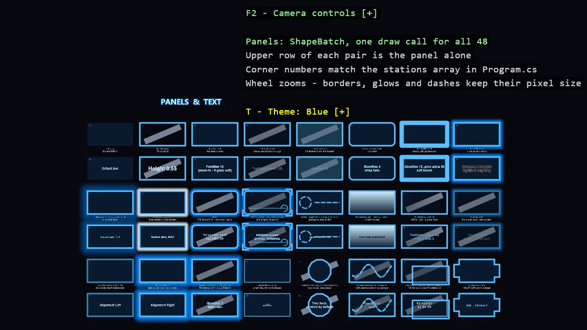

# 2D Panels and Text

Twenty-four HUD panel recipes side by side, each one property away from the last: fill only,
border only, transparent fill over a stripe that proves it, a fill colour of its own, rounded
corners, heavy borders, glows of three strengths and colours, glass, a ship-console panel with
corner ticks and a gauge, dashed rings and lines that turn and march, a gradient to the text
colour, a gradient to nothing, a panel at a third opacity, a translucent border, an additive
glow, a glow on a see-through panel, a hairline border, a twelve-sided badge, a forty-point
dashed route, two see-through panels overlapping, and a concave bracket frame. Every panel
appears twice - alone, and carrying world text that demonstrates height, font size, colour
alpha, opacity, glow, alignment and system fonts in regular, bold, italic and monospace. Five
themes switch live.

The `Program.cs` file shows how to:

- Panels with ShapeBatch - border, fill, glow, dashes, gradient and opacity as captured state
- A fill colour of its own versus a fill derived from the outline colour
- Showing transparency honestly by drawing a stripe behind every panel
- Dashes on rings and lines, animated by advancing the phase
- A fill gradient to a colour, and to alpha 0 for a glass fade
- One opacity over a whole panel
- Pixel-width lines and arcs as HUD ornaments that survive zooming
- An additive glow against a covering one, and a glow on a see-through panel
- A translucent border, a hairline border, and a polygon of any vertex count
- Strokes with DrawPixelPolyline - a dashed route and a concave, closed frame
- World text styling - Height, FontSize, TextColor alpha, Opacity, GlowColor and GlowSize
- Installed system fonts with SystemFonts, in four styles
- A live theme switch through a DebugOverlay dropdown

View on [GitHub](https://github.com/stride3d/stride-community-toolkit/tree/main/examples/code-only/E03_2D_Panels).

[!code-csharp]
