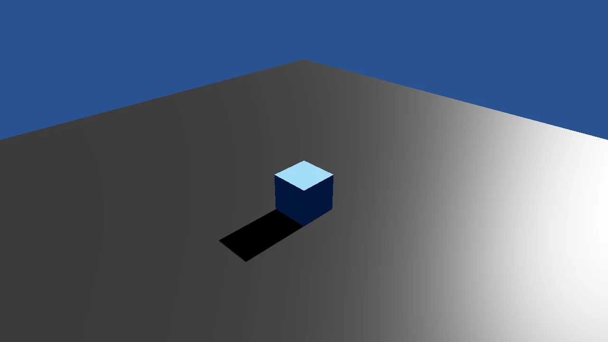

# Basic3D Scene (Engine Only)

A ground, a cube and a camera written against Stride alone, with no toolkit package: the graphics
compositor, the camera, the lights, the procedural models and the material that the toolkit's
SetupBase3D and Create3DPrimitive stand for. About ninety lines where the toolkit version is five,
and a map of what each helper does underneath.

The `Program.cs` file shows how to:

- Running scene code with game.Script.AddTask before game.Run
- GraphicsCompositorHelper.CreateDefault and SceneSystem.GraphicsCompositor
- A CameraComponent bound to the compositor's camera slot
- LightDirectional with shadows plus a LightAmbient fill
- PlaneProceduralModel and CubeProceduralModel generated into a Model
- A Material from a MaterialDescriptor

View on [GitHub](https://github.com/stride3d/stride-community-toolkit/tree/main/examples/code-only/E01_3D_BasicScene_EngineOnly).

[!code-csharp]