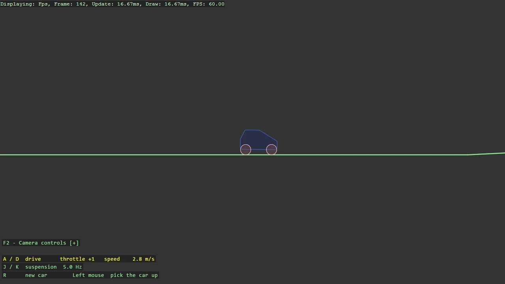

# Box2D Car

A car on two wheel joints over hilly terrain: the wheel joint pins the wheel, lets it turn,
springs it along the suspension axis with a travel limit, and drives it with a motor whose
speed is the throttle and whose zero is the brake. The terrain is one chain shape, so the
wheels never catch on a corner. A and D drive, J and K tune the suspension while riding, the
camera follows, and the grabber lifts the car to show the suspension working.

The `Program.cs` file shows how to:

- A drivable car from two wheel joints: pivot, suspension axis, spring, travel limit, motor
- Throttle as motor speed and braking as motor speed zero with torque still applied
- Terrain as one chain shape with ShapeFixtureBuilder.AttachChain, and why not a row of segments
- Retuning a joint while it runs through the Box2D wheel-joint functions
- Camera follow with Basic2DCameraController.FollowTarget, which frees the driving keys
- Using helpers: Joints2D.CreateWheel, Grabber2DScript, ShapeBatch, ShapeComponent

View on [GitHub](https://github.com/stride3d/stride-community-toolkit/tree/main/examples/code-only/E06_Box2D_Car).

[!code-csharp]
