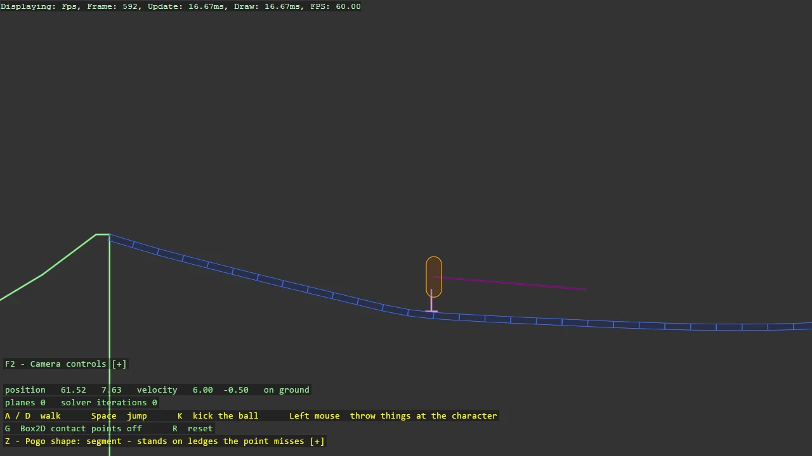

# Box2D Character Mover

A platformer character with no rigid body, on Box2D v3's mover API: a capsule the game moves
itself, Quake style, asking the world only what it touches - collect the contact planes, solve
a translation that respects them, sweep it - with a pogo shape cast from the feet that floats
it above the ground. The course is the samples' own: two Inkscape outlines read into chains,
a fifty-plank bridge that sags under the character, a ball to kick, a soft capsule to walk
through and a rigid elevator to ride. A and D walk, Space jumps, K kicks, Z picks the pogo
shape, and the grabber throws things at the character.

The `Program.cs` file shows how to:

- A character as a capsule plus a transform, not a body: why a rigid-body character fights you
- The mover loop: CollideMover for planes, SolvePlanes for a translation, CastMover for the sweep
- The pogo spring from a shape cast, and how it decides whether the character is on the ground
- Per-shape softness: a push limit and a velocity clip flag in the shape's user data
- Category bits so the mover overlaps some shapes, sweeps against others and kicks the rest
- Level outlines from SVG paths with SvgPath2D, as closed chain shapes
- A kinematic elevator driven by target transforms inside the fixed step
- Using helpers: CharacterMover2D, SvgPath2D, Joints2D.CreateRevolute, Grabber2DScript, Box2DDebugDraw, DebugTextDropdown

View on [GitHub](https://github.com/stride3d/stride-community-toolkit/tree/main/examples/code-only/E06_Box2D_CharacterMover).

[!code-csharp]
