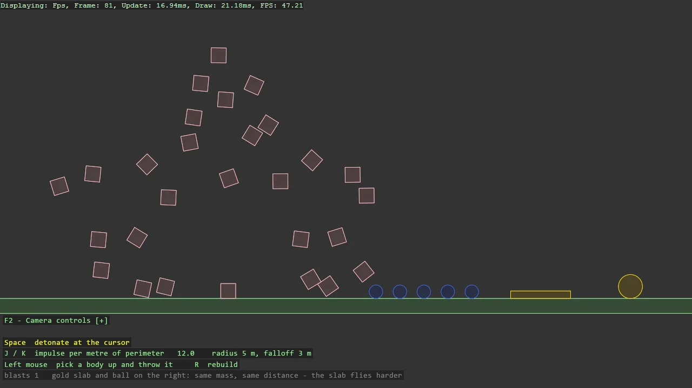

# Box2D Explosion

A grenade in one call: Explode gives every shape within a radius an impulse away from the
centre, per metre of perimeter facing the blast, so a wide slab flies harder than a ball of the
same mass. Space detonates at the cursor, rings show the radius and the falloff band, J and K
set the impulse, and the grabber on the camera rebuilds the pyramid by hand between blasts.

The `Program.cs` file shows how to:

- Radial impulses with Box2DSimulation.Explode - radius, falloff and impulse per length
- Why the impulse is per metre of perimeter, shown with a slab and a ball of equal mass
- Drawing a transient effect with ShapeBatch rings that fade
- Picking bodies up with Grabber2DScript
- Using helpers: SetupBase2D, Add2DCameraController, AddShapeBatch, ShapeComponent

View on [GitHub](https://github.com/stride3d/stride-community-toolkit/tree/main/examples/code-only/E06_Box2D_Explosion).

[!code-csharp]
