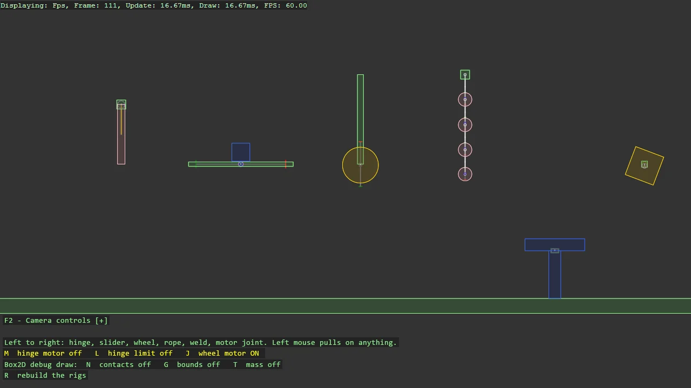

# Box2D Joints

Every Box2D joint, one rig each, in a row you can pull on: a hinge pendulum with a motor and a
limit, a slider on a spring, a wheel on a suspension, a rope of distance joints, a soft weld and
a motor joint that springs its box back home. Joints2D takes world-space pivots and axes and
turns them into the local frames Box2D wants, with options records for the per-type settings.
The grabber on the camera picks any body up, and the joints are drawn from their anchors.

The `Program.cs` file shows how to:

- Creating every Box2D joint type through Joints2D with world-space pivots and axes
- Options records that mirror the Box2D definition and leave the rest at Box2D's defaults
- Toggling a joint's motor and limit at runtime through the Box2D joint functions
- Drawing joints, contacts, bounds and mass with Box2DDebugDraw, Box2D's debug draw through ShapeBatch
- Pulling on constrained bodies with Grabber2DScript
- Using helpers: SetupBase2D, Add2DCameraController, AddShapeBatch, ShapeComponent

View on [GitHub](https://github.com/stride3d/stride-community-toolkit/tree/main/examples/code-only/E06_Box2D_Joints).

[!code-csharp]
