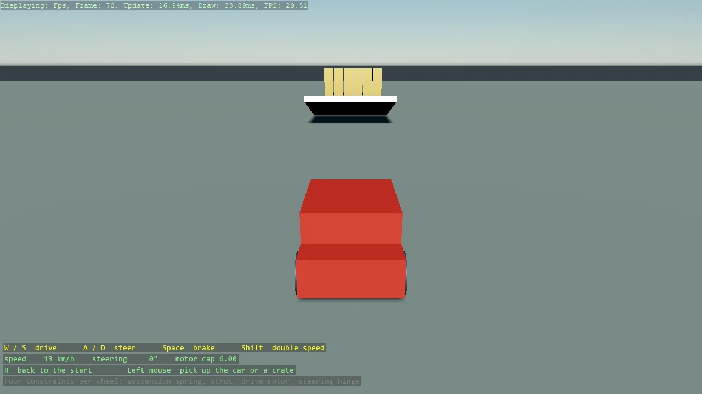

# Car

A drivable car from four constraints per wheel, the recipe of bepuphysics2's own car demo in
Stride's components: a linear axis servo as the suspension spring, a point-on-line servo as the
strut, an angular axis motor for drive and brake, and an angular hinge turned about the
suspension axis for steering, with Ackermann geometry on the front wheels. W S A D drive, a
chase camera follows, and the grabber lifts the car to show the suspension settle.

The `Program.cs` file shows how to:

- The four-constraint wheel: LinearAxisServo, PointOnLineServo, AngularAxisMotor, AngularHinge
- Steering by turning a hinge axis about the suspension direction, with Ackermann geometry
- Drive and brake as one motor with a velocity target and a force cap
- Re-applying constraint targets only when they change, so the car sleeps when idle
- Filtering chassis-wheel collisions with a collision layer that does not collide with itself
- A chase camera in place of the camera controller, to free the driving keys
- Using helpers: SetupBase3D, Add3DGround, Create3DPrimitive (both overloads), GrabberScript

View on [GitHub](https://github.com/stride3d/stride-community-toolkit/tree/main/examples/code-only/E05_3D_Car).

[!code-csharp]
