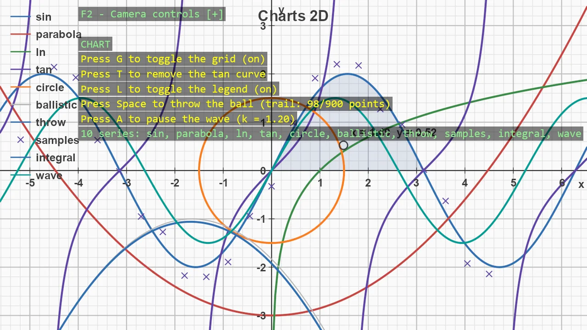

# Charts 2D

A flat, paper-like chart drawn entirely in code - no assets, no chart control, just meshes built at
runtime. Function plots handle their own awkward cases: ln(x) starts where its domain does, tan(x) is
cut into branches at its asymptotes instead of being joined by a false vertical line, and everything
is clipped to the chart's ranges. On top of that sit a parametric loop, scatter markers, a shaded
region under a curve, a trajectory that records a thrown ball while it flies, and a curve whose
function is swapped every frame. Pan and zoom and the chart re-targets its ranges to whatever the
camera sees, rebuilding axes, ticks, labels and curves for the new view - the Desmos trick.

The `Program.cs` file shows how to:

- Plotting y = f(x) with clipping, NaN handling and asymptote splitting
- Parametric curves closed back on themselves
- Scatter markers batched into one mesh
- Shading the region under a curve
- Recording a moving body with a growing trajectory
- Animating a curve by swapping its function in place
- A view-driven chart that follows an orthographic camera
- Grouped ChartOptions and per-series colour

View on [GitHub](https://github.com/stride3d/stride-community-toolkit/tree/main/examples/code-only/E11_2D_Charts).

[!code-csharp]
