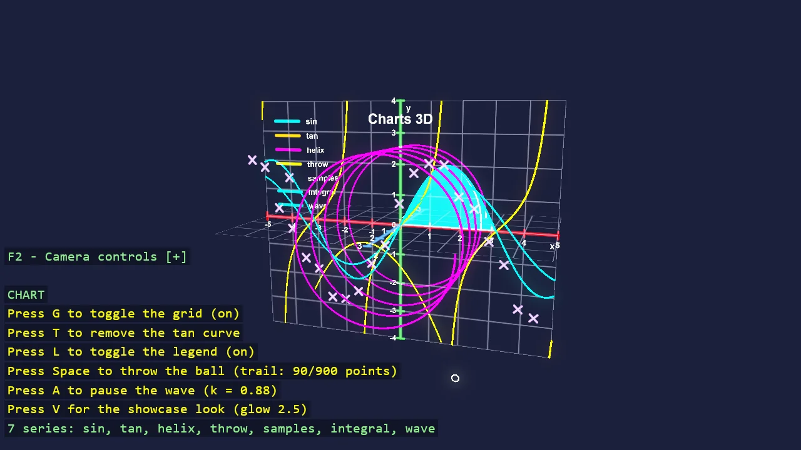

# Charts 3D

The same code-only chart API as the 2D example, in a lit 3D scene. A chart becomes 3D by giving its Z
range a spread: it gains a Z axis, its clipping becomes a box rather than a rectangle, and its grid can
cover the XZ floor as well as the XY wall. Curves that stay at z = 0 draw exactly as they do flat, so a
helix and a ball thrown through the depth are what actually use the third dimension. An orbit camera
inspects the figure from any angle, and FrameCamera backs the camera off until every corner of the
chart fits the window - the projection maths that decides how far "far enough" is.

The `Program.cs` file shows how to:

- Turning a chart 3D by giving its Z range a spread
- Box clipping instead of rectangle clipping
- Grid planes on the XY wall and the XZ floor
- A parametric helix through the depth of the chart
- A trajectory recorded through all three axes
- Orbiting a figure with Basic3DOrbitCameraController
- Framing a bounding box in a perspective camera with FrameCamera
- Emissive intensity above 1 glowing through bloom

View on [GitHub](https://github.com/stride3d/stride-community-toolkit/tree/main/examples/code-only/E11_3D_Charts).

[!code-csharp]
