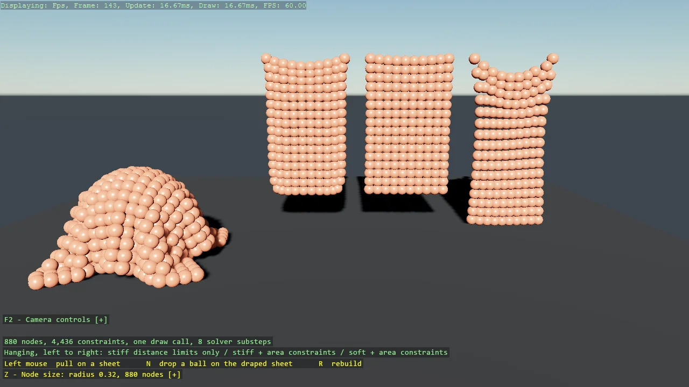

# Cloth

Cloth from ordinary bodies and constraints, the way bepuphysics2's own demo does it: a lattice
of sphere nodes tied by distance limits that may bunch but never stretch, area constraints on
every triangle against shear, and collision groups keeping neighbours from fighting. Three
sheets hang side by side to compare stiffness with and without area constraints, a fourth
drapes over a ball, nine hundred nodes are one instanced draw call, and the solver runs eight
substeps set through UseGameSettings. Pull on anything with the grabber, and pick the node
size from a menu: the sheets keep their dimensions, so smaller nodes mean a denser lattice
with finer folds and a higher body count.

The `Program.cs` file shows how to:

- Cloth as a lattice of bodies with CenterDistanceLimit and Area constraints - no special case needed
- A distance limit with a low minimum: the sheet can bunch but not stretch
- Area constraints against shear, and what a sheet looks like without them
- Keeping neighbouring nodes from colliding with CollisionGroup's index rule
- Solver substeps for a stiff connected system, set through UseGameSettings
- Drawing hundreds of bodies as one instanced master with BepuEntityInstancing
- Node size as lattice density: spacing follows the radius, the sheets keep their size, a DebugTextDropdown rebuilds
- Using helpers: SetupBase3D, Add3DGround, GrabberScript, DebugOverlay, DebugTextDropdown

View on [GitHub](https://github.com/stride3d/stride-community-toolkit/tree/main/examples/code-only/E05_3D_Cloth).

[!code-csharp]
