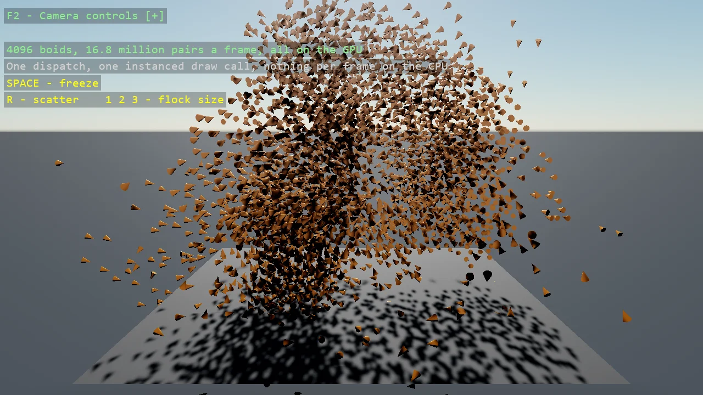

# Compute Shader Boids

A flock of thousands of boids that lives entirely on the GPU. A compute shader steers every boid
against every other one each frame - keep apart, fly the same way, stay together, come home - and
writes the world matrices straight into the buffers an instanced cone mesh is drawn from. The CPU
fills the buffers once and never touches a boid again: one dispatch, one draw call, nothing per
frame. Freeze the flock, scatter it, or switch between two, four and eight thousand boids.

The `Program.cs` file shows how to:

- Writing a compute shader in SDSL by inheriting ComputeShaderBase and overriding Compute()
- Running it with ComputeEffectShader from a scene renderer placed first in the compositor
- Unordered-access structured buffers, and two of them swapped each frame so reads never race writes
- Filling an InstancingUserBuffer's matrix buffers on the GPU, so the mesh is drawn from data the CPU never sees
- Building a world matrix and its inverse in a shader from a heading
- Using helpers: SetupBase3DScene
- Using helpers: AddSkybox
- Using helpers: Create3DPrimitive
- Using helpers: DebugOverlay

View on [GitHub](https://github.com/stride3d/stride-community-toolkit/tree/main/examples/code-only/E10_3D_ComputeBoids).

[!code-csharp]
