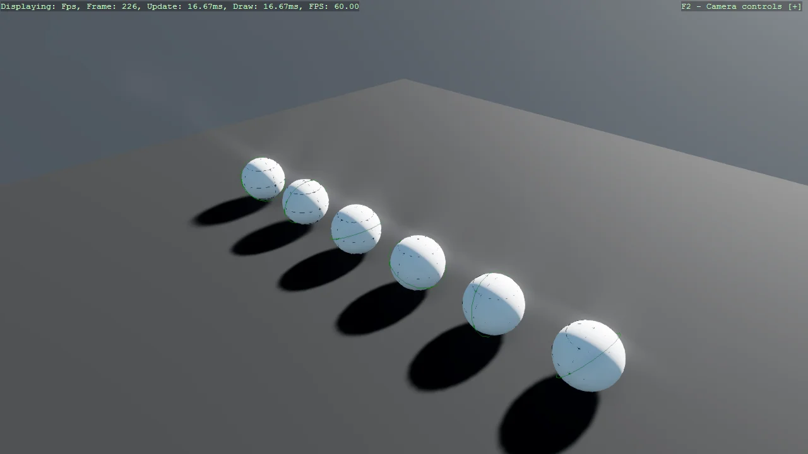

# DebugShapes Usage

This simple example demonstrates how to use the DebugShapes helpers to draw debug shapes.

The `Program.cs` file shows how to:
- Initialize the DebugShapes system and enable it for the scene
- Draw sphere and circle shapes at specific positions

> [!NOTE]
> Other required NuGet package: `Stride.CommunityToolkit.DebugShapes`.

View on [GitHub](https://github.com/stride3d/stride-community-toolkit/tree/main/examples/code-only/E08_3D_DebugShapes_QuickStart).

[!code-csharp]