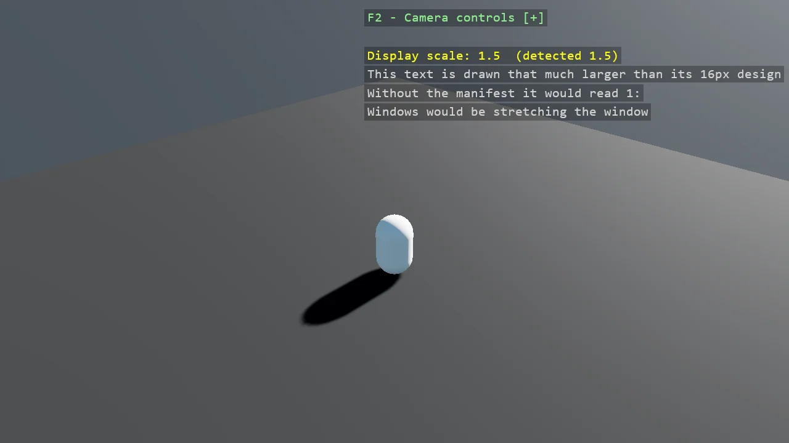

# DPI-Aware Window

The capsule scene again, with two differences. One is not in the C# at all: an app.manifest declaring
the process per-monitor DPI aware, referenced from the csproj. Without it Windows scales the window
itself on a high-DPI display and the result is a blurred, upscaled image. The other is what a sharp
window then needs: with Windows no longer enlarging anything, 16-pixel text on a 150% display is two
thirds the height it should be, so DisplayScale reads the display's factor and the overlay follows
it - the help text is the same size to the eye on any monitor. The example exists because the first
fix is invisible in the source, so it is easy to conclude that Stride renders badly when the real
cause is a missing manifest.

The `Program.cs` file shows how to:

- Why a high-DPI display renders a blurred window without a manifest
- Declaring per-monitor DPI awareness in app.manifest
- Wiring the manifest in with <ApplicationManifest>
- Reading the display's scale factor with DisplayScale, and why the overlay follows it by default
- Referencing Stride.CommunityToolkit.Windows for Windows-only concerns
- Using helpers: SetupBase3DScene, AddSkybox, Create3DPrimitive

View on [GitHub](https://github.com/stride3d/stride-community-toolkit/tree/main/examples/code-only/Example01_Basic3DScene_DPI_Aware).

[!code-csharp]
