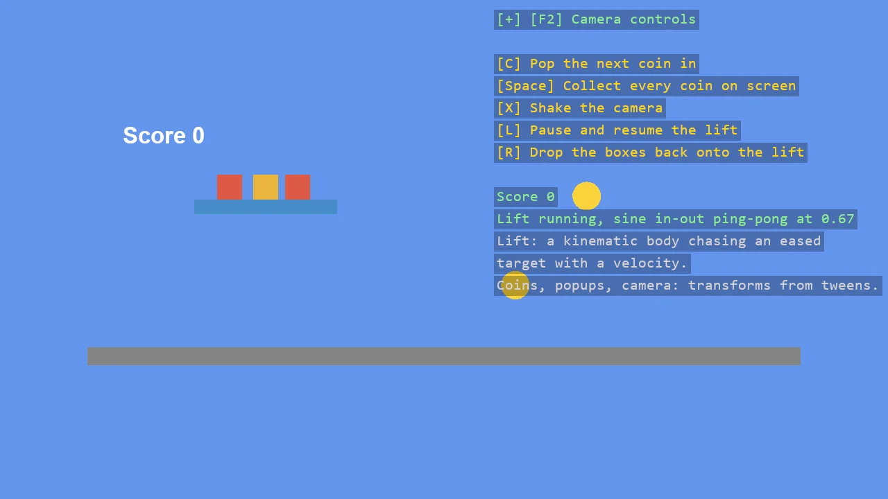

# Easing in a 2D Game

Easing doing real work in a 2D physics scene, each piece a Tween: a kinematic lift carries a
stack of boxes up and down on a sine curve, coins pop in with an overshoot and fly to the score
when collected, a "+10" rises and fades, and a landing shakes the camera on an elastic curve.
The lift shows how an eased value drives a Bepu body: as a target the body chases with a
velocity, never as a transform write.

The `Program.cs` file shows how to:

- Tween - start, feed the frame time, read Lerp
- Driving a kinematic Bepu 2D body towards an eased target with feed-forward velocity plus a correction
- A pop-in by scale, a flight by position, a rise-and-fade on one tween
- An elastic ease-out as a camera shake
- Visual-only primitives with IncludeCollider off, next to physics bodies

View on [GitHub](https://github.com/stride3d/stride-community-toolkit/tree/main/examples/code-only/E02_2D_EasingInGame).

[!code-csharp]
