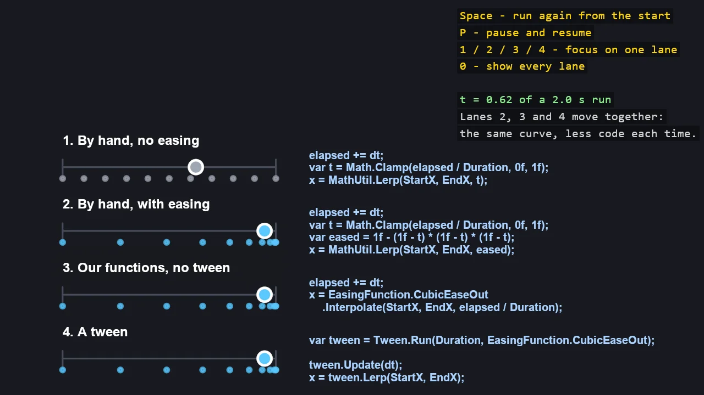

# Easing Basics

Easing from the ground up, in four lanes that move a disc over the same two seconds: by hand
with no easing, by hand with one formula, with the toolkit's easing functions, and with a
Tween. The last three use the same curve and move in lockstep, while each needs less code than
the one above it, printed beside its lane. Dots along every lane show the spacing that makes
easing visible.

The `Program.cs` file shows how to:

- Progress as elapsed time divided by duration, clamped to 0 to 1
- Easing as one formula that bends the progress before a lerp
- EasingFunction.Interpolate, which also clamps the time
- Tween, which also keeps the clock
- Evenly spaced positions for no easing, bunched positions for an ease-out

View on [GitHub](https://github.com/stride3d/stride-community-toolkit/tree/main/examples/code-only/E02_2D_EasingBasics).

[!code-csharp]