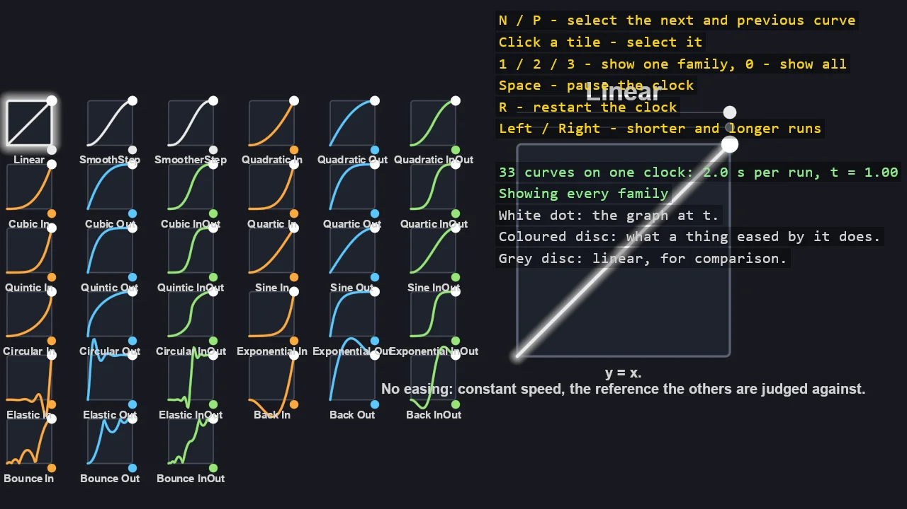

# Easing Cheat Sheet

Every easing curve in the toolkit on one screen: a tile per curve with its graph, a dot riding
the graph on a shared clock, and a slider that moves the way a thing eased by that curve would.
Click a tile to see the curve large with its formula and a race against a linear mover, and
filter by ease-in, ease-out and in-out families. The cheat sheet that runs.

The `Program.cs` file shows how to:

- EasingFunction and Easing - every curve by name and by direct call
- The fluent extensions - function.Ease(t) and function.Interpolate(start, end, t)
- Why the dispatcher clamps time and the raw curves do not
- Ease-in, ease-out and in-out families, and what overshoot looks like in motion
- A 2D ShapeBatch scene with pixel polylines, discs and a dashed reference line
- Screen-space labels with EntityTextComponent, and DebugOverlay for the keys

View on [GitHub](https://github.com/stride3d/stride-community-toolkit/tree/main/examples/code-only/E02_2D_Easing).

[!code-csharp]