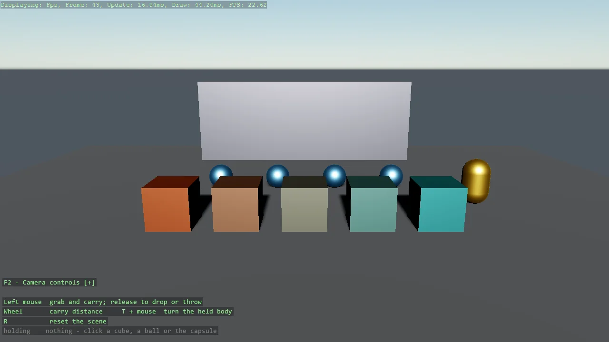

# Grabber

A gravity gun: click any body to pick it up, carry it on the end of the camera ray, and let go
- with its velocity, so a flick throws it. GrabberScript on the camera entity does it with two
servo constraints rather than a teleport, so the held body still collides and pushes, and the
force caps scale with mass so a 100 kg cube drags like a 1 kg one. Cubes of five masses, balls
to flick, a capsule with locked rotation, and a wall to throw at.

The `Program.cs` file shows how to:

- Picking up and throwing bodies with GrabberScript, one line on the camera entity
- Why servo constraints beat teleporting a kinematic body for a drag
- Force caps scaled by mass, so heavy and light bodies feel the same in the hand
- Locking a body's rotation through its BodyInertia, and what the grabber does about it
- Reading the held body's mass and the servo cap from the script for the overlay
- Using helpers: SetupBase3DScene, Create3DPrimitive, GetCameraEntity, DebugOverlay

View on [GitHub](https://github.com/stride3d/stride-community-toolkit/tree/main/examples/code-only/E05_3D_Grabber).

[!code-csharp]
