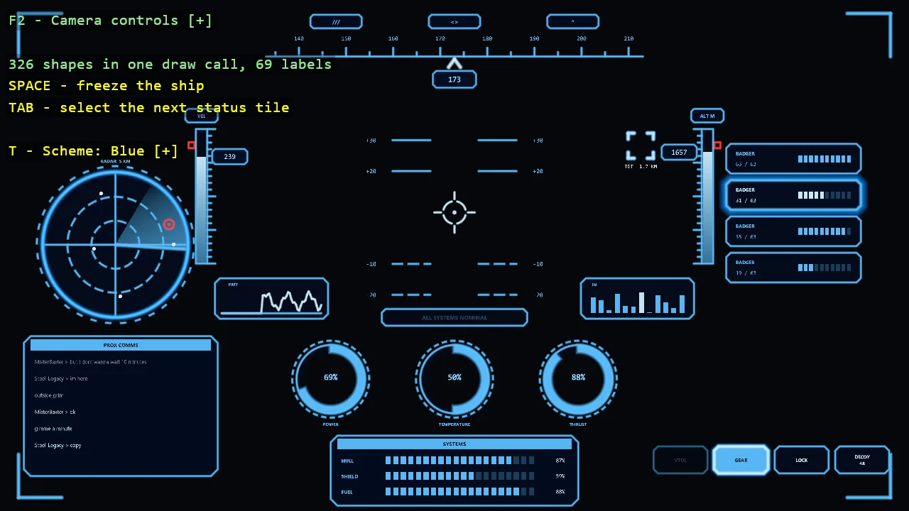

# Ship HUD

A cockpit HUD composed from the toolkit's shapes and world text: a heading tape that scrolls, a
pitch ladder, a gun-sight, speed and altitude tapes with moving readouts, a radar with a sweep
and contacts, ring gauges, a sparkline drawn as one glowing stroke, a spectrum, a comms log in a
framed panel, four status tiles with a selected one that glows, mode buttons with one disabled,
and a warning strip that goes amber and then red as the shield drops. The lit things - the
sight, the sweep, the selected tile, the annunciator - add their light with additive glows.
Every shape is one draw call; five colour schemes switch live; the ship flies itself so every
widget moves.

The `Program.cs` file shows how to:

- Composing a HUD from ShapeBatch panels, bars, arcs, sectors and pixel lines in one draw call
- Framed panels with chamfered corners as a single convex polygon
- Selected against idle, disabled, and warning states as border, fill alpha and glow
- Dashed rings as one shape each, and a fading sweep as a sector with a gradient
- Strokes with DrawPixelPolyline - a sixty-four-point trace, corner brackets with one round join
- Additive glows for the things that emit light, covering glows for halos
- World text updated in place, reused for scrolling tape labels
- A theme that leaves warning and danger colours alone
- A simulated ship as functions of time, frozen by freezing the clock

View on [GitHub](https://github.com/stride3d/stride-community-toolkit/tree/main/examples/code-only/E03_2D_HUD).

[!code-csharp]
