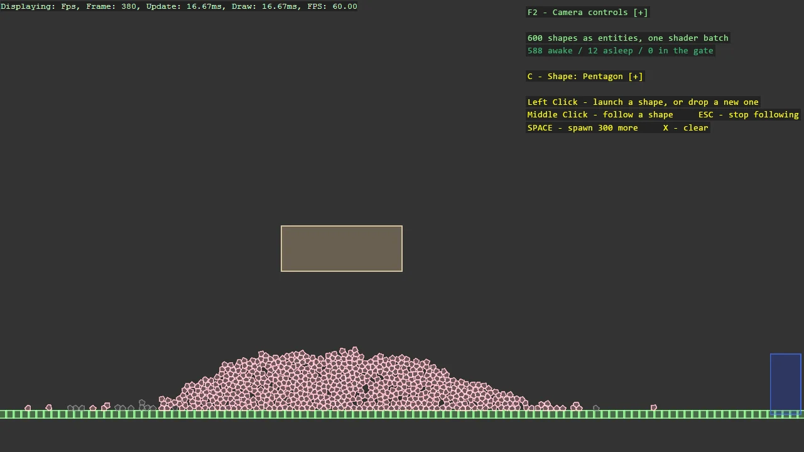

# Junkyard Playground (Box2D)

The playground sibling of the Junkyard replica: the same walled yard and sweeping plow, built
the Stride way - every shape is an entity carrying ShapeComponent and a Box2D body, so
components, scripts, events and the camera all join in. Pentagons, circles, capsules and boxes
fall and mix freely, switchable at runtime. A sensor gate turns anything passing through gold via
the library's sensor events; clicking launches or drops shapes; middle-click makes the camera
follow one through the pile.

The `Program.cs` file shows how to:

- One entity per shape with ShapeComponent - the testbed look through the component system
- Mixing shape kinds freely in one scene, impossible with per-model instanced masters
- Circles and capsules through the SDF shader's rounding radius
- Building the collider from the same vertices as the visual, so they always agree
- Sensor fixtures and the library's sensor events driving gameplay colour
- Mouse picking with OverlapPoint, impulses with BodyForces
- Camera follow through Basic2DCameraController.FollowTarget

View on [GitHub](https://github.com/stride3d/stride-community-toolkit/tree/main/examples/code-only/E06_Box2D_JunkyardInteractive).

[!code-csharp]
