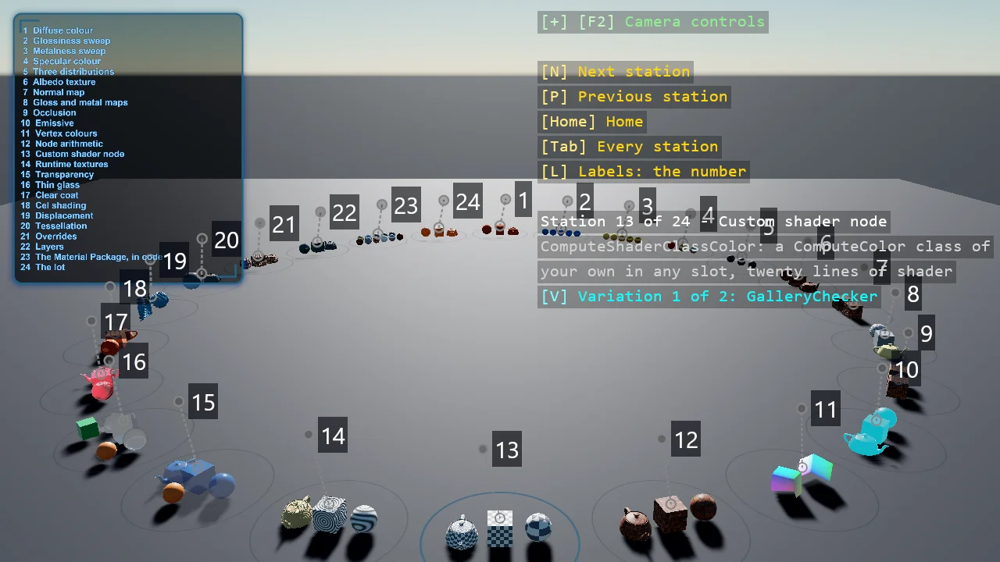

# Material Gallery

The engine's material system on a ring of stations, all from code: the four numbers of a PBR
material first, then the maps, the inputs a map can be built from, and the surfaces and shading
models that change what light does - transparency, glass, clear coat, cel shading, hair,
subsurface scattering, displacement and tessellation, layers - ending with Game Studio's Material Package
transcribed into C#. Every station puts its materials on the same three shapes, and most
have variations on a key.

The `Program.cs` file shows how to:

- Building a Material from a MaterialDescriptor in code - diffuse, glossiness, metalness, specular models
- The metalness and the specular workflows, and what each number does
- Textures as material inputs - colour maps as sRGB, data maps as linear
- Normal, glossiness, metalness, occlusion and emissive maps
- Compute nodes - vertex streams, arithmetic, a custom shader class, textures made at runtime
- Transparency, thin glass, clear coat, cel shading, hair and subsurface scattering
- Displacement, tessellation and material layers
- Game Studio's Material Package, transcribed from its .sdmat files

View on [GitHub](https://github.com/stride3d/stride-community-toolkit/tree/main/examples/code-only/E02_3D_MaterialGallery).

[!code-csharp]