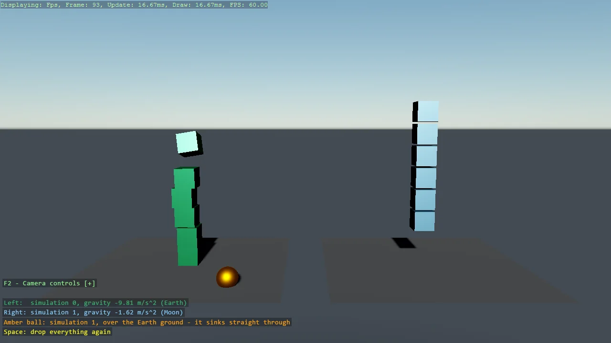

# Multiple Physics Simulations

Two Bepu simulations in one game, side by side: the left lane falls under Earth gravity, the
right under Moon gravity, and an amber ball that belongs to the Moon world sinks straight
through the Earth ground because the two worlds never touch. The simulation list comes from
UseGameSettings, the code-only stand-in for the GameSettings asset, and each body picks its
world with a SimulationSelector.

The `Program.cs` file shows how to:

- Configuring physics before the game starts with UseGameSettings and BepuConfiguration
- Giving each simulation its own gravity
- Choosing a simulation per body and per static with IndexBasedSimulationSelector
- Why bodies in different simulations pass through each other
- Respawning entities with Space
- Showing instructions as a DebugOverlay section beside the camera help
- Using helpers: SetupBase3D, Add3DGround, Create3DPrimitive, SetCameraPosition, SetCameraRotation

View on [GitHub](https://github.com/stride3d/stride-community-toolkit/tree/main/examples/code-only/E05_3D_MultipleSimulations).

[!code-csharp]
