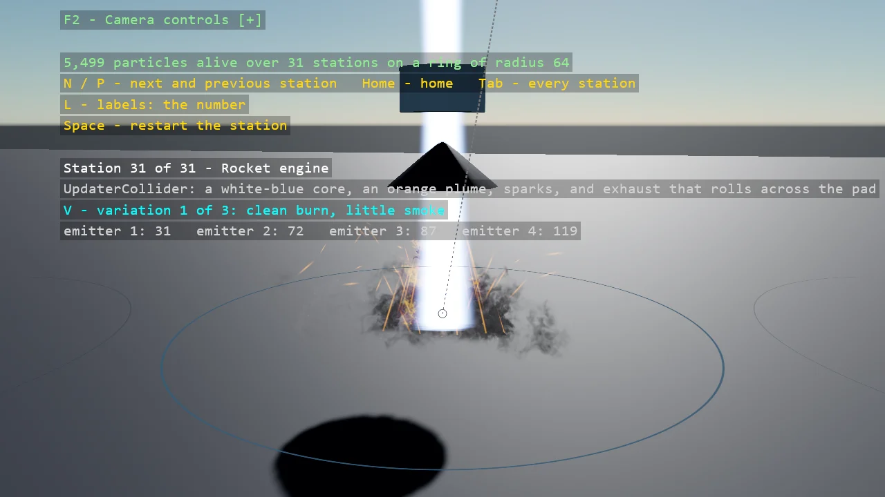

# Particle Gallery

Thirty-one particle systems on a ring of stations, all built from code: the building blocks one at a
time - spawners, shapes, initializers, updaters, materials, flipbooks, soft particles - and then
the showpieces that put them together: a campfire, fireworks with child emitters, a tornado, a
swarm driven by an updater of our own, lasers, rain that splashes, a portal, a rocket engine. Most
stations have variations on a key, so what a setting does is a keypress away.

The `Program.cs` file shows how to:

- Building a ParticleSystemComponent from code - emitters, spawners, initializers, updaters, shapes, materials
- Textures, flipbooks and scrolling texture coordinates on particles
- Curves over a particle's life for size, colour and rotation
- Force fields, colliders and spawning by distance
- Child emitters spawned on a parent's death, distance or collision
- Soft particles against geometry
- Writing an updater and an initializer of your own
- A ring of stations from the shared gallery frame in Example.Common, with variations per station

View on [GitHub](https://github.com/stride3d/stride-community-toolkit/tree/main/examples/code-only/E09_3D_Particles).

[!code-csharp]