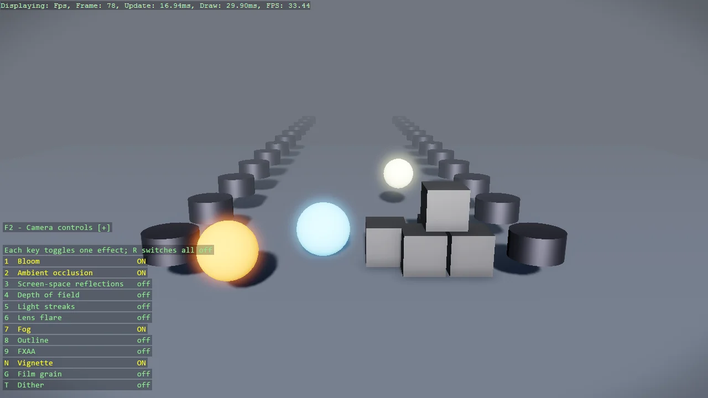

# Post Effects

Every post effect Stride ships, one key each: bloom, ambient occlusion, screen-space reflections,
depth of field, light streaks, lens flare, fog, outline, FXAA, and the vignette, film-grain and
dither colour transforms. The default compositor has all of them switched off, so the example is
the answer to "how do I turn bloom on" - a first set is enabled through ConfigurePostEffects, the
rest toggle at runtime - and to the less obvious rule that colour transforms must be added, not
enabled. The scene is built for the effects: over-bright lamps, a glossy floor, a receding corridor
and a cluster of cubes.

The `Program.cs` file shows how to:

- Enabling post effects with ConfigurePostEffects, and toggling them at runtime with GetPostEffects
- Which effects exist on the compositor and start disabled
- Adding Vignetting, FilmGrain and Dither to the colour-transform group, where they cost nothing extra
- Building an emissive material above intensity 1 so bloom has something to bloom
- Showing live effect state as a DebugOverlay section
- Using helpers: SetupBase3D, Add3DGround, Create3DPrimitive, CreateMaterial

View on [GitHub](https://github.com/stride3d/stride-community-toolkit/tree/main/examples/code-only/Example40_PostEffects).

[!code-csharp]
