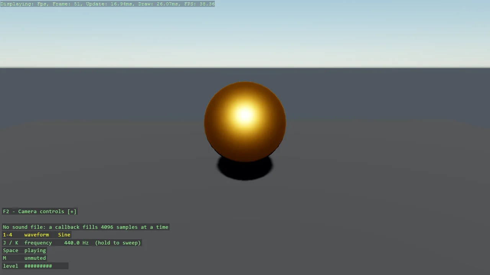

# Procedural Sound

A tone with no sound file: a callback computes the samples as they play. Stride's Sound type
only comes out of the asset pipeline, so this is how a code-only game makes a noise at all -
the SoundInstance constructor that takes a DynamicSoundSource, wrapped by CreateProceduralSound.
Digits pick sine, square, sawtooth or triangle, J and K sweep the pitch, and the orb swells with
the signal level.

The `Program.cs` file shows how to:

- Why there is no Sound in a code-only game, and the door that is open: DynamicSoundSource
- Generating audio in a callback with game.Audio.CreateProceduralSound
- Sharing state between the game thread and the audio thread without a lock
- Buffering and the latency it implies
- Showing live audio state as a DebugOverlay section
- Using helpers: SetupBase3DScene, Create3DPrimitive, CreateMaterial

View on [GitHub](https://github.com/stride3d/stride-community-toolkit/tree/main/examples/code-only/Example27_Audio_ProceduralSound).

[!code-csharp]
