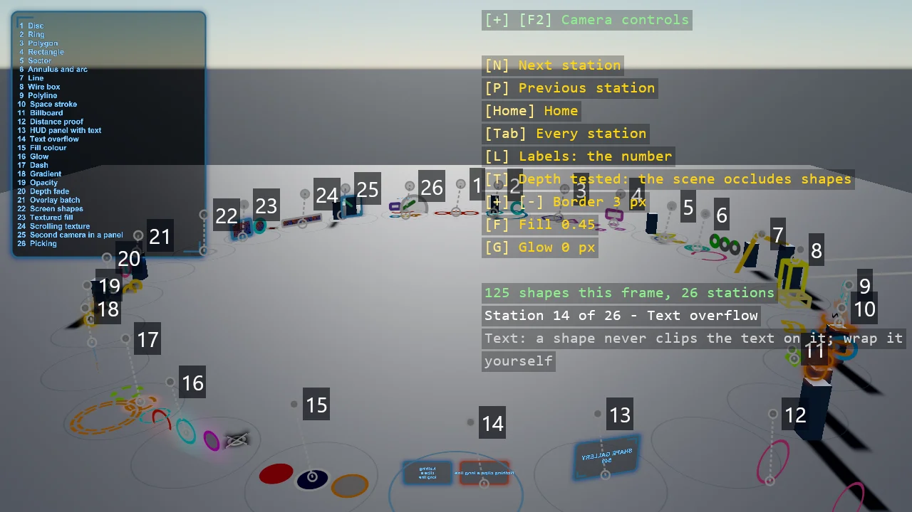

# ShapeBatch Shapes

The full tour of ShapeBatch in 3D: ground discs and selection rings, decals, glowing HUD panels
with world text on them, genuinely thick 3D lines and wire boxes, camera-facing billboards, pie wedges, donut
charts and radial progress arcs, a glow that halos any of them, dashed rings and lines that turn
and march, fills that run to a colour or fade to nothing, and one opacity over a whole shape.
Every shape is flat and evaluated per fragment as a signed distance function, so its outline
stays a constant number of pixels wide however far away it is - press 7 and fly down the
corridor of rings to see it.

The `Program.cs` file shows how to:

- Registering a shape renderer with AddShapeBatch
- Depth-tested shapes versus overlay shapes from two batches
- Discs, rings and polygons lying on an arbitrary plane in 3D
- HUD panels with glowing edges and glowing world text, including a live counter
- Thick 3D lines and wire boxes from camera-facing capsules
- Billboards that keep their shape from any viewpoint, and pixel-radius markers that keep their size at any distance
- Sectors, annuli and round-capped arcs for pie, donut and progress indicators
- An outer glow measured in pixels, for halos and neon
- Dashes in pixels on rings and lines, animated through their phase
- A fill gradient across a shape's own extent, to a colour or to alpha 0
- One opacity over border, fill and glow together
- Why a signed distance function keeps an outline a constant pixel width

View on [GitHub](https://github.com/stride3d/stride-community-toolkit/tree/main/examples/code-only/E11_3D_ShapeBatch).

[!code-csharp]
