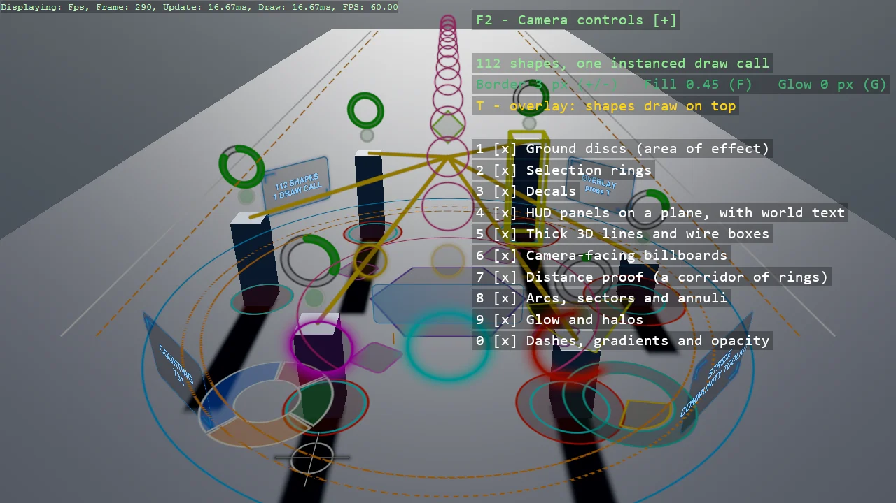

# Shapes Playground

The full tour of ShapeBatch in 3D: ground discs and selection rings, decals, glowing HUD panels
with world text on them, genuinely thick 3D lines and wire boxes, camera-facing billboards, pie wedges, donut
charts and radial progress arcs, and a glow that halos any of them. Every shape is flat and
evaluated per fragment as a signed distance function, so its outline stays a constant number of
pixels wide however far away it is - press 7 and fly down the corridor of rings to see it.

The `Program.cs` file shows how to:

- Registering a shape renderer with AddShapeBatch
- Depth-tested shapes versus overlay shapes from two batches
- Discs, rings and polygons lying on an arbitrary plane in 3D
- HUD panels with glowing edges and glowing world text, including a live counter
- Thick 3D lines and wire boxes from camera-facing capsules
- Billboards that keep their shape from any viewpoint
- Sectors, annuli and round-capped arcs for pie, donut and progress indicators
- An outer glow measured in pixels, for halos and neon
- Why a signed distance function keeps an outline a constant pixel width

View on [GitHub](https://github.com/stride3d/stride-community-toolkit/tree/main/examples/code-only/Example_Shapes_Playground).

[!code-csharp]
