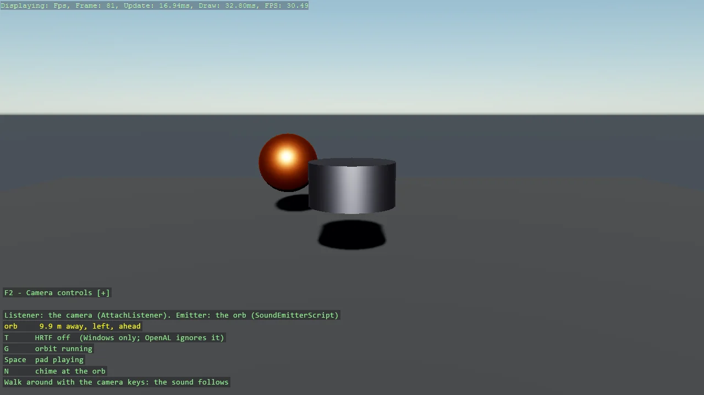

# Spatial Sound

3D positional audio for a runtime sound: a looping pad on an orb that circles a pillar, heard
from the camera. The instance is created spatialised and positioned every frame by
SoundEmitterScript; the listener is the camera's, obtained with AttachListener, because the
engine's default listener never moves. T recreates the instance with HRTF on or off to compare
the two, G pauses the orbit, N fires a one-shot chime at the orb.

The `Program.cs` file shows how to:

- Creating a spatialised instance and positioning it with Apply3D through SoundEmitterScript
- Why the default listener is useless for a moving camera, and AttachListener as the fix
- HRTF as two switches - HrtfSupport through UseGameSettings, then useHrtf per instance
- Positioning a one-shot once versus tracking a moving emitter every frame
- Reading the emitter's side and distance relative to the camera for the overlay
- Using helpers: UseGameSettings, SetupBase3DScene, Create3DPrimitive, DebugOverlay

View on [GitHub](https://github.com/stride3d/stride-community-toolkit/tree/main/examples/code-only/E12_Audio_Spatial).

[!code-csharp]
