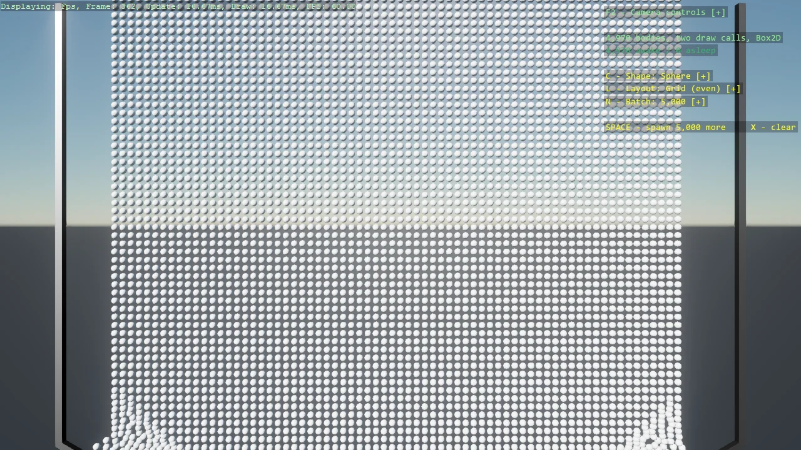

# Basic 2D Scene (Stress Pile, Box2D)

The Box2D twin of the stress pile: thousands of bodies piling up, drawn in two instanced draw
calls - awake bodies through one master, sleeping bodies tinted green through another - with the
shape, batch size and spawn layout switchable while it runs, simulated by Box2D.NET instead of
Bepu. The tint makes the engines' sleep behaviour directly comparable. The rendered shapes are the same nine 3D primitives; each
gets the 2D fixture matching its head-on silhouette, so a sphere falls as a circle and a cylinder
as a box. The differences from the Bepu version are the lesson: the simulation is created and
stepped by hand, bodies must be removed from it explicitly when the pile is cleared, and the
sleep-skipping instancing reads Box2DBodyComponent instead of Bepu's BodyComponent.

The `Program.cs` file shows how to:

- Drawing thousands of physics bodies in two instanced draw calls, split by sleep state
- Tinting sleeping bodies by moving instances between an awake and a sleeping master
- Driving the pile with Box2D.NET through Stride.CommunityToolkit.Box2D
- Mapping 3D rendered primitives to their 2D head-on fixtures
- Removing bodies from an external simulation explicitly, no processor does it
- Skipping instancing work while every Box2D body sleeps with Box2DEntityInstancing
- Disabling contact events on fixtures nothing listens to
- Switching shape, batch size and layout at runtime with DebugTextDropdown
- Picking bodies out of the pile with Grabber2DScript, on a perspective camera

View on [GitHub](https://github.com/stride3d/stride-community-toolkit/tree/main/examples/code-only/E10_2D_StressPile_Box2D).

[!code-csharp]
