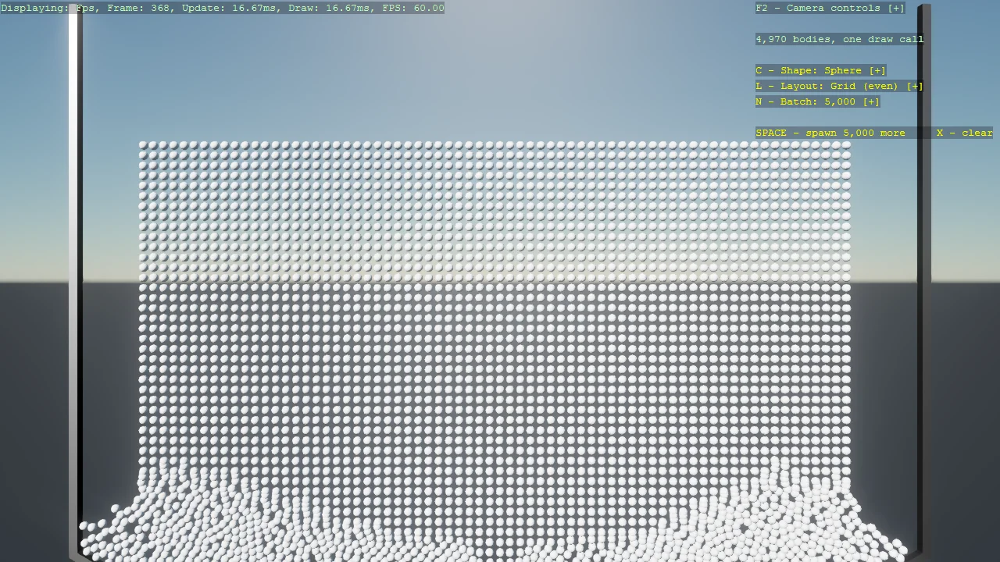

# Basic2D Scene (Stress Pile)

Thousands of 2D physics bodies piling up, drawn in two instanced draw calls - awake bodies through
one master, sleeping bodies tinted green through another - with the shape, batch size and spawn
layout switchable while it runs. Because one master entity per sleep state draws every body, all
of them share one of two Models and shapes cannot be mixed - changing shape clears and
respawns the pile, which the example uses to show how to tear a pile down safely. Models are cached
per shape and the instancing object is reused rather than recreated, so switching costs nothing.
Grid spawns are deliberately jittered: a perfectly regular lattice of touching bodies degenerates
Bepu's broad-phase tree.

The `Program.cs` file shows how to:

- Drawing thousands of physics bodies in two instanced draw calls, split by sleep state
- Tinting sleeping bodies by moving instances between an awake and a sleeping master
- Confining bodies to the XY plane with Body2DComponent
- Sharing one Model across every body instead of generating one each
- Tearing down an instanced pile safely, clearing the instancing before the entities
- Switching shape, batch size and layout at runtime with DebugTextDropdown
- Why a perfectly regular spawn lattice must be jittered
- Using helpers: AddInstancingSupport, AddInstancingBufferUpload, AddBepu3DPhysics

View on [GitHub](https://github.com/stride3d/stride-community-toolkit/tree/main/examples/code-only/E10_2D_StressPile).

[!code-csharp]
