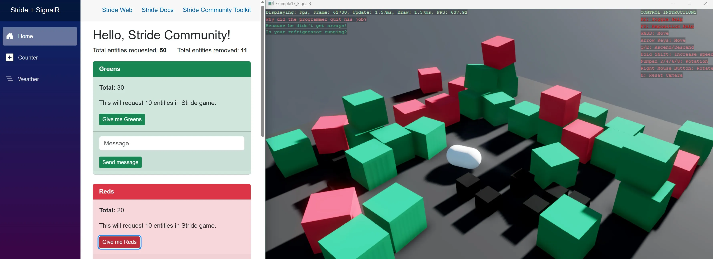

# Stride + SignalR

An orbital cargo deck with two consoles: a Stride game window and a Blazor web page, talking both ways over a SignalR hub. Either console releases cargo containers through a hatch, clears the deck, shakes it or switches the colour scheme, and the game reports every release, landing and loss back to the page, plus a census once a second.

The hub is an optional feature. The game connects in the background and keeps retrying; when there is no hub, the keyboard does everything and the overlay says `LINK OFFLINE`. Start the host afterwards and the game picks it up on its next attempt, with no restart.

## Running it

Three projects, two processes:

| Project | What it is |
|---|---|
| `E13_SignalR_Shared` | The contracts both sides compile against: DTOs, the hub and client interfaces, the colour schemes and paints as hex strings |
| `E13_SignalR_Blazor` | The ASP.NET host: the hub, which is a relay with no state, and the web console page |
| `E13_SignalR` | The Stride game |

1. Start `E13_SignalR_Blazor` first, so the hub exists. The IIS Express profile listens on `https://localhost:44369`, which is where the game looks by default. On Kestrel the port differs; point the game at it with the `STATION_HUB_URL` environment variable, for example `https://localhost:7167/station`.
2. Start `E13_SignalR`. The overlay's second line turns to `LINK ONLINE` when the hub answers.
3. Open the Blazor page. The `HUB` lamp lights when the page reaches the hub, the `GAME` lamp when the first census arrives from the game, within a second.

In the game: `1` `2` `3` release a small, medium or large container, `SPACE` a random one, `B` a batch of ten, `C` clears the deck, `X` shakes it, `T` opens the scheme list and `1`-`5` pick one. The camera flies with the right mouse button and `WASD`.

## What goes over the wire

Every call is a method on one of two shared interfaces. The hub is `Hub<IStationClient>` and implements `IStationHub`; the game and the page send with `nameof(IStationHub.Method)` and register handlers with `nameof(IStationClient.Method)`, so renaming a method breaks the build on every side at once instead of failing quietly at runtime.

| Direction | Hub method | Client method | Payload |
|---|---|---|---|
| Either console to the other | `ReleaseContainer` | `ReleaseRequested` | size and paint, either one `null` for random |
| | `ReleaseBatch` | `BatchRequested` | a count |
| | `ClearDeck` | `ClearRequested` | |
| | `ShakeDeck` | `ShakeRequested` | |
| | `SetScheme` | `SchemeRequested` | a scheme name |
| | `Hail` | `HailReceived` | a line of text for the game's overlay |
| Game to the pages | `ReportReleased` | `ContainerReleased` | id, size, paint, which console asked |
| | `ReportLanded` | `ContainerLanded` | the same, plus where and after how long |
| | `ReportLost` | `ContainerLost` | a container that slid off the open edge |
| | `ReportCleared` | `DeckCleared` | how many were removed |
| | `ReportScheme` | `SchemeChanged` | the scheme now in force |
| | `ReportDeck` | `DeckUpdated` | the census: counts by size and paint, mass, totals, scheme, uptime |

The hub relays with `Clients.Others`, so nothing echoes back to its sender. A scheme change works the same from both sides: the console that chose it applies it at once, the game announces it, and every open page follows. The census is what makes a late page complete: it carries the scheme too, so the hub never has to remember anything.

## The threading rule

SignalR delivers messages on its own threads, and the deck may only be touched from the game thread. Every handler the game registers does one thing: it queues a closure. The update loop drains that queue at the top of each frame and replays the closures against the deck. Reports go the other way through one background queue, in order, so a landing can never overtake the release it belongs to.

Shutting down with a live connection has an order to it, and the comments in `Program.cs` explain why neither disposal awaits.

View the Stride example on [GitHub](https://github.com/stride3d/stride-community-toolkit/tree/main/examples/code-only/E13_SignalR), the Blazor host [here](https://github.com/stride3d/stride-community-toolkit/tree/main/examples/code-only/E13_SignalR_Blazor), and the shared contracts [here](https://github.com/stride3d/stride-community-toolkit/tree/main/examples/code-only/E13_SignalR_Shared).

[!code-csharp]
