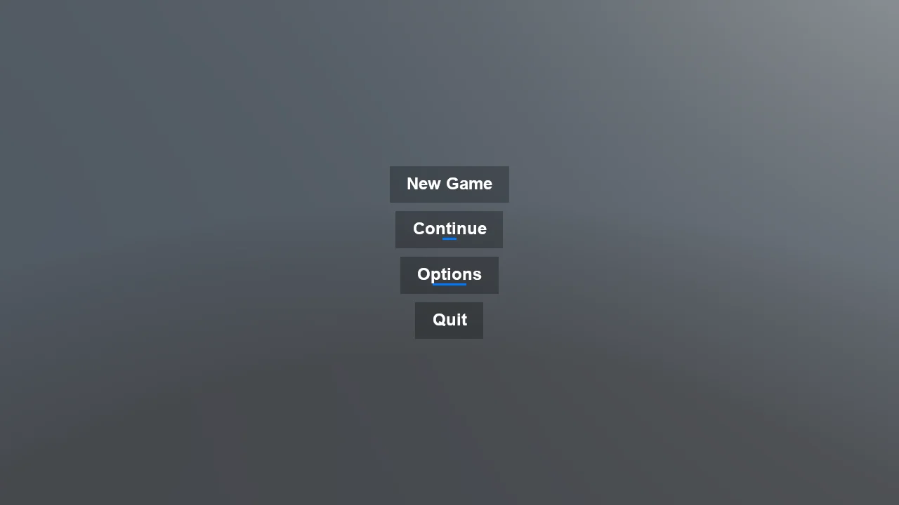

# Stride UI - Button Hover Animation

A main menu built from code whose buttons grow a blue underline while the pointer is over them.
Two things make a hover effect work in Stride's UI, and both are easy to miss. A Button reports
nothing in MouseOverState until RequiresMouseOverUpdate is set on it, which is off by default
because tracking it costs a hit test per element per frame - forgetting it is the usual reason a
hand-written hover effect does nothing at all. And the animation is a lerp toward a target width
rather than a fixed step per frame, so it settles in the same time whatever the frame rate and
reverses smoothly when the pointer leaves mid-animation.

The `Program.cs` file shows how to:

- Reacting to the pointer with RequiresMouseOverUpdate and MouseOverState
- Animating a UI element from a SyncScript
- Frame-rate independent movement with a clamped lerp
- Laying an underline out inside the button so nothing resizes
- Driving many UI elements from a single script
- Using helpers: SetupBase3D, AddSkybox

View on [GitHub](https://github.com/stride3d/stride-community-toolkit/tree/main/examples/code-only/E04_StrideUI_ButtonHoverAnimation).

[!code-csharp]
