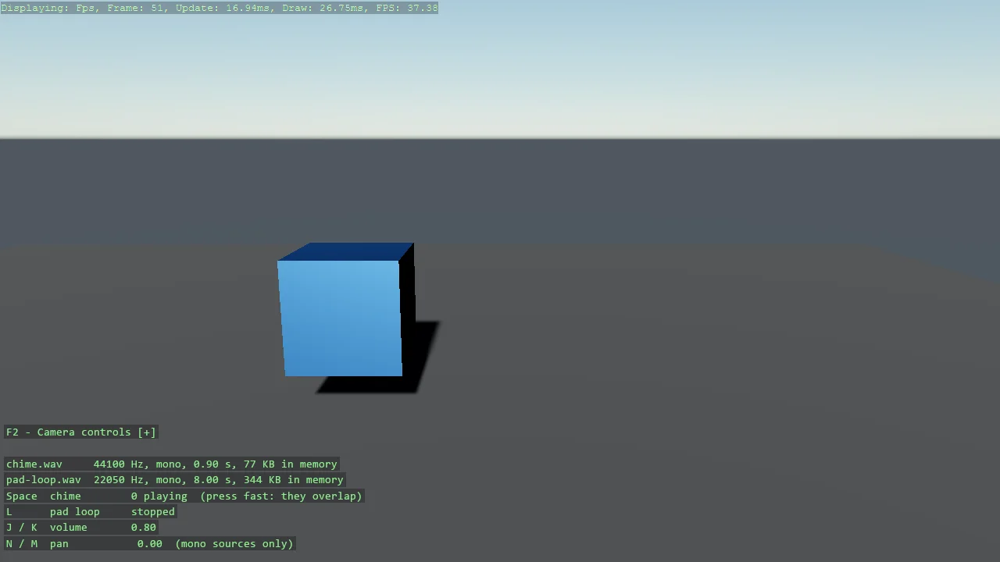

# Wav File

Play a .wav read from disk at runtime, with no compiled asset: LoadWav decodes the file into
memory and each CreateInstance is an independent playback. Space fires a chime - press it fast
and the instances overlap - L toggles a looping pad, J and K set the volume, N and M the pan.
The overlay shows what was decoded and how many instances are alive, and finished instances
are disposed once they report Stopped.

The `Program.cs` file shows how to:

- Loading a .wav at runtime with game.Audio.LoadWav instead of the asset pipeline
- One WavSound, many overlapping instances
- Looping, volume and pan on a SoundInstance
- Disposing instances once they have played out
- Why the files are mono: Pan and spatialisation need a single channel
- Using helpers: SetupBase3DScene, Create3DPrimitive, DebugOverlay

View on [GitHub](https://github.com/stride3d/stride-community-toolkit/tree/main/examples/code-only/Example27_Audio_WavFile).

[!code-csharp]
