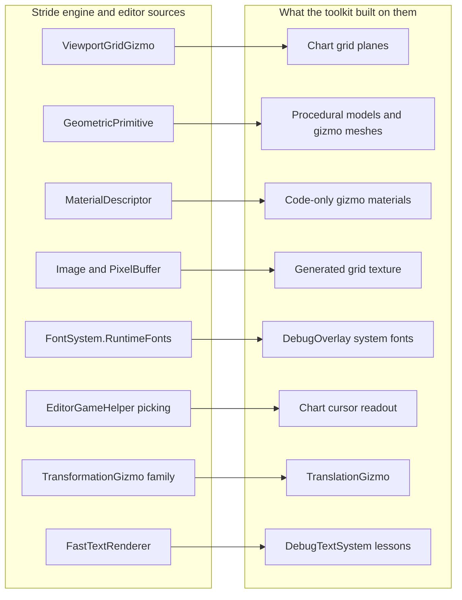

# Engine Patterns

Stride ships with its own editor, and the editor is a Stride game. That one sentence is worth more
than it looks: every hard rendering problem Game Studio has solved - a grid that stays calm at any
zoom, gizmos you can grab, picking under the cursor, text without a font asset - is solved *in C#, in
the open, under MIT*, in the same engine your game uses. The documentation does not index these
internals, so most of them are found only by reading the source.

This page is that index, or at least the beginning of one: patterns the toolkit has borrowed from the
engine and editor sources, with where each lives, what the toolkit built on it, and where it could fit
in a game. Source paths are relative to the [Stride repository](https://github.com/stride3d/stride)
`sources/` folder, as of Stride 4.4.

The tempting path, every time, is to reimplement. We know because we took it: the toolkit's chart
playground first drew its grid as triangle-ribbon lines, and the result shimmered and faded at every
zoom level - while ten metres away Game Studio's scene grid sat perfectly still. The fix was not
better geometry; it was discovering that the editor's grid *is not geometry at all*. That story is the
first entry.

## The editor grid: lines that are not lines

**Where:** `editor/Stride.Assets.Presentation/AssetEditors/Gizmos/ViewportGridGizmo.cs`

Game Studio's scene grid is a single textured plane. A 256-pixel texture holds one grid cell with its
border drawn as one-pixel lines - and **every mip level is authored by hand** so that the average
brightness of each level matches the top one. Sampled with an anisotropic wrapping sampler, the GPU
blends between those levels itself: lines neither alias away when tiny nor blow out when dense, and
nothing ever gets rebuilt. Two more tricks complete the illusion of infinity: the grid scale snaps in
decades (0.1, 1, 10, 100) based on camera distance, and the plane's position snaps to cell multiples
near the camera, so the edge of the finite plane never comes into view.

The lesson generalises past grids: **when thin repeating detail must stay stable at every distance,
put it in a texture and let the sampler do the anti-aliasing.** Rasterising thin triangles fights the
hardware; sampling a well-mipped texture uses it.

**In the toolkit:** the chart playground's grid (`Example_Charts_Playground/Charts/ChartGridTexture.cs`)
is this technique nearly verbatim - same luminance-constant mip formula, same emissive-times-colour
material, same snapping - with the decade steps swapped for the chart's 1-2-5 tick steps.

**In a game:** build-mode placement grids, city-builder zoning overlays, the synthwave infinite floor
(this plus emissive intensity above 1 and bloom *is* that aesthetic), sports-pitch and runway
markings, chain-link fences - anything line-patterned that the camera sees at changing distance.

## Runtime primitives: meshes without assets

**Where:** `engine/Stride.Graphics/GeometricPrimitives/GeometricPrimitive.cs` (and the per-shape files
beside it)

`GeometricPrimitive.Plane.New(device, ...)`, `.Sphere.New(...)`, `.Cone.New(...)`, `.Teapot.New(...)` -
complete vertex and index buffers from a couple of parameters, no asset pipeline involved. The editor
uses them for every gizmo and for the grid plane; they convert to a render-ready mesh with
`.ToMeshDraw()` (the extension lives in `Stride.Extensions`).

**In the toolkit:** the code-only primitives (`Create3DPrimitive`, the 2D procedural models) and the
gizmo meshes are built this way, as is the chart's grid plane.

**In a game:** placeholder art that ships, debug volumes, procedural level geometry, anything a
code-only project needs before an artist exists.

## Code-only materials: MaterialDescriptor

**Where:** `engine/Stride.Rendering/Rendering/Materials/` - and every editor gizmo for usage examples

`Material.New(device, new MaterialDescriptor { Attributes = { ... } })` compiles a full engine
material at runtime: emissive or diffuse features, transparency blending, cull mode, texture inputs
with samplers of your choice. The editor never loads a material asset for its gizmos or grid; it
describes them in code, sets colours through `ParameterKeys` it declares itself, and updates those
parameters live.

**In the toolkit:** `Rendering/Gizmos/GizmoEmissiveColorMaterial.cs` and
`GizmoUniformColorMaterial.cs` are small factories over this; the chart grid material adds the
texture-times-colour and anisotropic-sampler variations copied from the editor.

**In a game:** highlight and hologram materials, team colours set per instance, debug visualisation -
any material whose definition is more natural as three lines of code than as an asset.

### The transparency trap

Asking for a translucent colour is not enough to get a translucent material. We learned this shading
the area under a curve: the fill simply was not there, and forcing the colour opaque proved the
geometry had been right all along. Three things have to line up.

1. **A transparency feature.** `Attributes.Transparency = new MaterialTransparencyBlendFeature()` is
   what sets a blend state on the pass and marks it transparent. Setting `MaterialPass.HasTransparency`
   by hand looks like the same thing and is not: the generated shader never learns to blend.
2. **A shading feature that writes the alpha.** `MaterialEmissiveMapFeature` only assigns
   `shadingColorAlpha` when its `UseAlpha` flag is set; otherwise the material alpha comes from the
   diffuse channel. If the colour carrying your alpha is the emissive one, say so.
3. **Premultiplied colour.** Stride blends with `BlendStates.AlphaBlend`, which is *premultiplied*
   (`One, InvSrcAlpha`), and the emissive and lit contributions are added to the shading colour without
   being scaled by alpha. Run the value through `Color4.PremultiplyAlpha` after the colour-space
   conversion; skip it and a half-transparent surface reads as a glowing one.

The editor does all three: `ViewportGridGizmo.CreateColoredTextureMaterial` builds the descriptor and
`UpdateGrids` premultiplies the colour it pushes into its parameter key. Bepu's `CollidableGizmo` is
the shorter version of the same recipe.

**In the toolkit:** `GizmoEmissiveColorMaterial.Create` follows this path automatically when the colour
it is handed has an alpha below 255, and leaves opaque colours on the cheaper opaque path.

## CPU-side images: authoring textures pixel by pixel

**Where:** `core/Stride.Foundation/Graphics/Image.cs` (note the home: this class moved from the old
`Stride` assembly into `Stride.Foundation` in 4.4 - see the caveats below)

`Image.New2D(width, height, mipMapCount: true, format)` allocates an image *with its whole mip chain*
on the CPU, `image.PixelBuffer[i].SetPixel(x, y, color)` writes any level, and `Texture.New(device,
image)` uploads the lot. That last part is the rare capability: most texture helpers generate mips for
you; this one lets you *author* each level - which is exactly what the grid technique above needs.

**In the toolkit:** the chart grid texture is generated this way at startup, mips and all.

**In a game:** procedural textures (noise, gradients, identicons), minimap fog-of-war, decals baked at
runtime - and any case where the automatic mip average is the wrong answer for small sizes.

## Runtime fonts: text without a font asset

**Where:** `engine/Stride.Graphics/Font/FontSystem.cs` (see `RuntimeFonts`)

The font system can register a TTF/OTF file at runtime and hand back a dynamic `SpriteFont` that
rasterises glyphs on demand at whatever size is requested - no compiled font asset. The engine uses
this machinery internally; it is reachable from game code through the font system's runtime-font
registration.

**In the toolkit:** `DebugOverlay` uses it to load a *system* font (Consolas, DejaVu Sans Mono, Menlo -
per platform) so debug text is sharp at any DPI scale without shipping a font file - see
`Scripts/Utilities/DebugOverlay.cs` and the [Debug Overlay](rendering/debug-overlay.md) page.

**In a game:** user-selected or modded fonts, chat and user-generated text in scripts your shipped
font lacks, tools that must respect the OS look.

## Picking: from cursor to world point

**Where:** `editor/Stride.Assets.Presentation/AssetEditors/GameEditor/Game/EditorGameHelper.cs`

Everything the editor does with the mouse - selecting, dragging gizmos, placing the grid - starts with
the same two steps: unproject the cursor into a ray, intersect the ray with something. The helper
also shows the production-hardened details: limiting the projection angle so a grazing ray does not
produce a point kilometres away, and validating the inverted view matrix before trusting it.

**In the toolkit:** `CameraComponentExtensions` (`GetPickRay`, `ScreenToWorldPoint`,
`CalculateRayFromScreenPosition`) provides the same steps for game code; the chart playground's
cursor readout intersects that ray with the chart's plane and works identically under an orthographic
2D camera and a free 3D camera.

**In a game:** click-to-move, object placement under the cursor, aiming decals, measuring tools.

## The gizmo family: an in-game editor, already written

**Where:** `editor/Stride.Assets.Presentation/AssetEditors/Gizmos/` - `TransformationGizmo.cs`,
`TranslationGizmo.cs` and a dozen siblings

Grabbable translation arrows, rotation rings, per-axis colouring and hover states, light and camera
icons that billboard and scale with distance - the whole vocabulary of a 3D editor, implemented as
entity scripts against the public engine API. Nothing about them requires the editor to run.

**In the toolkit:** `Rendering/Gizmos/TranslationGizmo.cs` and `LightDirectionalGizmo.cs` adapt the
patterns for code-only scenes.

**In a game:** level editors and building modes, photo modes, modding tools, debug object nudging.

## FastTextRenderer: the 8×16 font, and why to know its limits

**Where:** `engine/Stride.Graphics/FastTextRenderer.cs`

This is the bitmap-font renderer behind `DebugTextSystem.Print` - a fixed 8×16 pixel font on a static
texture, extremely cheap, zero assets. Knowing its internals explains its quirks, which we learned as
scar tissue while building the overlay: the glyph texture has a dark strip baked into it (so text
carries its own contrast on any background), `DrawString` centres the first glyph on the given
position rather than starting there, and the fixed pixel size means a 4K display renders it half the
intended physical size. The toolkit's `DebugOverlay` moved to a real `SpriteFont` for exactly those
reasons - but the fast renderer remains the right tool when you want one guaranteed-cheap line of
text with literally zero setup.

**In a game:** frame counters and dev HUDs, crash-screen diagnostics, retro console aesthetics.

## Summary

| Pattern | Engine source (under `sources/`) | Toolkit use | Game use |
|---|---|---|---|
| Mip-authored texture grid | `editor/.../Gizmos/ViewportGridGizmo.cs` | Chart grid planes | Build grids, infinite floors, line markings |
| Runtime primitives | `engine/Stride.Graphics/GeometricPrimitives/` | Procedural models, gizmos, grid plane | Placeholder and procedural meshes |
| Code-only materials | `engine/Stride.Rendering/.../Materials/` | Gizmo and grid materials | Highlights, holograms, team colours |
| CPU image authoring | `core/Stride.Foundation/Graphics/Image.cs` | Generated grid texture | Procedural textures, fog-of-war |
| Runtime fonts | `engine/Stride.Graphics/Font/FontSystem.cs` | DebugOverlay system fonts | User and modded fonts |
| Picking helpers | `editor/.../GameEditor/Game/EditorGameHelper.cs` | Camera extensions, chart cursor | Placement, aiming, measuring |
| Gizmo scripts | `editor/.../AssetEditors/Gizmos/` | TranslationGizmo and friends | In-game editors, photo modes |
| Fast bitmap text | `engine/Stride.Graphics/FastTextRenderer.cs` | DebugTextSystem (and its lessons) | Dev HUDs, retro text |

## The honest caveats

- **Internals are not API.** These classes carry no compatibility promise: `Image` moved assemblies in
  4.4, editor classes reorganise between releases. Borrow the *pattern* - copy and adapt the code into
  your project - rather than referencing editor assemblies, which also drag in the whole editor
  dependency tree.
- **Licence is not a problem; provenance still matters.** Stride is MIT, editor included. Keep the
  copyright header when you copy a file substantially, as the toolkit does.
- **The editor's constraints are not yours.** Editor code favours robustness over throughput (it
  validates matrices every frame, recreates textures on device reload). When you adapt it, decide
  which of those costs your game actually needs.
- **Reading order matters.** The fastest way into any of these files is to run Game Studio, find the
  behaviour you want on screen, then search the sources for the string or key you can see - a colour,
  a parameter name, a menu label. That is how every entry on this page was found.
