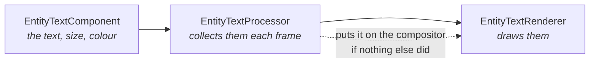

# Using toolkit components in Game Studio

You add **World Text** to an entity in Game Studio, type something into `Text`, and the label
appears in the viewport, in the editor's own view, before you press Play. The same goes for
**Entity Text** and for **Shape**. This page explains what makes that work, what the manual
`Add*` calls are still for, and what to check when a component does not draw.

## A component is data; a processor sees to the rest

Most engine components are self-contained: add a `ModelComponent`, assign a model, and it renders.
The toolkit's drawing components are built the same way Stride's own are, in two halves. The
component holds *what* to draw; a processor collects every component of its kind each frame, and a
renderer draws them:

The dashed step is the one that used to be missing. The renderer had to be registered by the
running game, from code, and Game Studio never runs a game's setup code - the editor builds the
game itself - so a component added in the editor collected quietly and nothing consumed it. The
processors now do that step themselves: the first time one has something to draw, it makes sure
its renderer is on the compositor of the scene it lives in, and it checks again whenever the
editor swaps compositors, which happens at start and on every change of the viewport's view mode.

The processors also run in the editor, not only at runtime, which is what makes the viewport show
the result while you edit.

## What the manual calls are still for

`game.AddEntityTextRenderer()`, `game.AddWorldTextRenderer()` and `game.AddShapeBatch()` remain,
and code-only projects keep calling them. They are no longer required for a component to draw;
they are how you take control:

| Call | What it gives you beyond the automatic path |
|---|---|
| `AddShapeBatch(depthTest)` | The batch handle, for drawing shapes from code every frame; the choice between a depth-tested batch and an overlay one; more than one batch in a scene. Components draw through the first batch registered this way and inherit its border, fill and glow state. |
| `AddWorldTextRenderer()` / `AddEntityTextRenderer()` | The renderer on the compositor before the first frame, and at the position in the renderer chain you choose. |

Without them a component gets a depth-tested shape batch, or a text renderer appended to the end
of the compositor's renderer chain, made on the first frame the component is drawn.

## Two things that look like failures but are not

**Nothing appears when you click the shape.** Clicking a shape in the viewport does not select it:
Stride's picking pass renders entity ids for models, and a shape is not a model. Select the entity
in the hierarchy instead; the transform gizmo then works as usual.

**Text needs no font.** Leaving `Font` empty is the supported path: the renderer falls back to
Stride's own `StrideDefaultFont`. Set one only when you want a *different* font, not to make text
appear at all.

## When it still does not draw

Work down this list; each cause looks identical from the outside.

1. **Does the component appear in Add-component at all?** If a toolkit component is missing from the
   list entirely, the library was not registered for scanning. See
   [Making components work in Game Studio](../contributing/toolkit/game-studio-components.md).
2. **Is there anything to draw?** A `Shape` with no vertices, or a text with an empty `Text`, draws
   nothing by design. A `Shape` needs at least one vertex, and a single vertex needs a `Radius`.
3. **Is the entity where you think it is?** `WorldTextComponent` is positioned in the world and can
   sit behind the camera; `EntityTextComponent` in screen mode is placed in pixels; a `Shape` lies
   in its entity's XY plane unless `Billboard` is on, so a rotated entity can show it edge-on.
4. **Look at the Output pane.** The shape processor logs one line when it registers its own batch,
   and an effect that failed to compile is reported there, with the shader's name.

## Related

- [Entity Text](rendering/entity-text.md) - screen-space text anchored to an entity
- [World Text](rendering/world-text.md) - text living in the 3D scene
- [ShapeBatch](rendering/shape-batch.md) - the shapes, and `ShapeComponent`
- [Components and Scripts](components-and-scripts.md) - when to write a component, a processor or a script