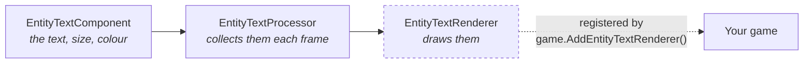

# Using toolkit components in Game Studio

You add **Entity Text** to an entity in Game Studio, type something into `Text`, press Play - and
nothing appears. No error, no warning in the log, no red squiggle anywhere. The component is there,
its properties look right, and the screen stays empty.

Nothing is broken. The component is only half of a pair, and the other half has to be switched on
from code. This page explains why, and what the one line is.

## A component is data; something else draws it

Most engine components are self-contained: add a `ModelComponent`, assign a model, and it renders.
Several toolkit components are deliberately not like that. They hold *what* to draw, while a
**renderer** registered with the running game decides *how* and *whether*:



The dashed step is the one Game Studio cannot do for you. In a code-only project you write that call
yourself while setting the game up, so it never comes up. In Game Studio there is no such moment -
the editor builds the game - so the component collects quietly and nothing consumes it.

## The one line

Add a script to any entity in the scene and register the renderer once, in `Start`:

```csharp
using Stride.CommunityToolkit.Engine;
using Stride.Engine;

namespace MyGame;

public class ToolkitSetup : StartupScript
{
    public override void Start()
    {
        // ScriptComponent.Game is IGame; the toolkit extensions are declared on Game
        var game = (Game)Game;

        game.AddEntityTextRenderer();
        game.AddWorldTextRenderer();
    }
}
```

That is all. Every `EntityTextComponent` and `WorldTextComponent` in the scene - however many, added
whenever - starts drawing. The calls are safe to repeat; a second renderer is never added.

## Which call each component needs

| Component | Register with | Package |
|---|---|---|
| `EntityTextComponent` | `game.AddEntityTextRenderer()` | `Stride.CommunityToolkit` |
| `WorldTextComponent` | `game.AddWorldTextRenderer()` | `Stride.CommunityToolkit` |
| `ShapeComponent` | `game.AddShapeBatch()` | `Stride.CommunityToolkit.Shapes` |

Until the components register their own renderers, each one carries the reminder in its display
name - the Add-component list shows **Entity Text (call AddEntityTextRenderer)** rather than just
*Entity Text*. It is deliberately blunt, and it will disappear when it is no longer needed.

## Two things that look like failures but are not

**Nothing appears in the editor viewport, ever.** These processors run at `ExecutionMode.Runtime`,
so they are inactive while you are editing and only draw once you press Play. An empty viewport is
not a sign that something is misconfigured.

**Text needs no font.** Leaving `Font` empty is the supported path: the renderer falls back to
Stride's own `StrideDefaultFont`. Set one only when you want a *different* font, not to make text
appear at all.

## When it still does not draw

Work down this list; each cause looks identical from the outside.

1. **Is the renderer registered?** By far the most common cause, and the one this page is about.
2. **Are you in Play mode?** See above.
3. **Does the component appear in Add-component at all?** If a toolkit component is missing from the
   list entirely, that is a different problem - the library was not registered for scanning. See
   [Making components work in Game Studio](../contributing/toolkit/game-studio-components.md).
4. **Is the entity where you think it is?** `WorldTextComponent` is positioned in the world and can
   sit behind the camera; `EntityTextComponent` in screen mode is placed in pixels.

## Related

- [Entity Text](rendering/entity-text.md) - screen-space text anchored to an entity
- [World Text](rendering/world-text.md) - text living in the 3D scene
- [Components and Scripts](components-and-scripts.md) - when to write a component, a processor or a script