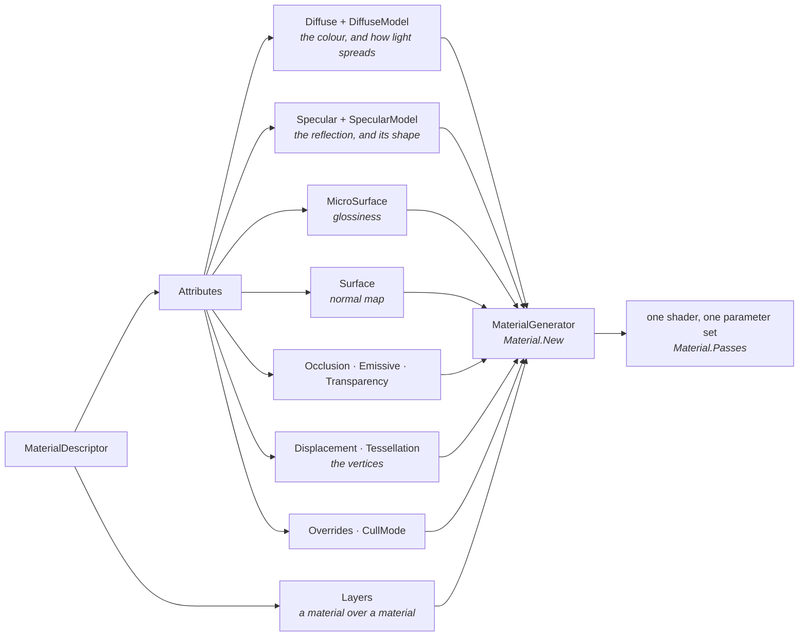
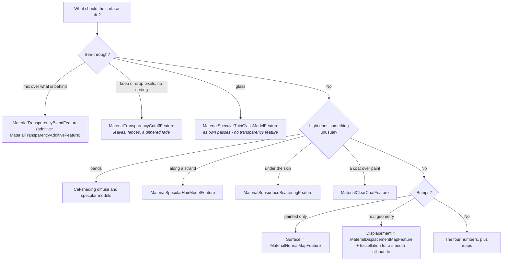

# Materials from code - a bag of features, not a shader

When a cube needs to look like something, the first thing you reach for is `game.CreateMaterial(Color.Green)`,
and the second is its two numbers. That works, right up to the point where you want glass, or brick with
mortar lines the light falls into, or a coat of paint peeling off iron - and then it looks as if the next
step is writing a shader. It is not. Every material in Stride, the ones Game Studio saves as assets and
the ones the toolkit builds in one line, is the same thing: a **descriptor**, a bag of small feature
objects, that the engine turns into a shader for you. This page is about that bag - what goes in it,
what each piece changes on screen, and the handful of things that go wrong when you build one from code.
Every rule is illustrated by real code in this repository, most of it in the
[Material Gallery](../code-only/examples/material-gallery.md) (`E02_3D_Material_Gallery`), a ring of
twenty-eight stations you can walk through and compare.

## The wrong path: turn the numbers up

The toolkit's helper is honest about what it is:

```csharp
// src/Stride.CommunityToolkit/Engine/GameExtensions.cs
public static Material CreateMaterial(this IGame game, Color? color = null, float metalness = 0f, float glossiness = 0.65f)
```

Two fractions, and the shader clamps both. Until the day this page was written the parameters were
called `specular` and `microSurface`, and the beginner example asked one of them for a value of 4:

```csharp
// examples/code-only/E02_3D_Material/Program.cs, as it was
Create3DPrimitive(scene, new Vector3(-5f, 0.5f, -5f), game.CreateMaterial(Color.Green, 4f, 0.75f));
```

That is a metalness of 4, clamped to 1: a metal, whose green is mostly thrown away. And the cube did not
even look like a metal; it looked black, for a reason that is the first story below. The numbers are not
knobs to turn; each is a physical claim about the surface, and the claims only make sense once you know
what the bag holds.

## One material, many features

A `MaterialDescriptor` has an `Attributes` object with one slot per *aspect* of a surface, and a
`Layers` list. Each slot takes a small class - a **feature** - and the material generator composes the
features into one shader when `Material.New` runs:



Two consequences follow, and both matter more than any single feature:

- **What you leave out is left out of the shader.** No `Surface` feature means no tangent-space work at
  all; no `Specular` means no highlight and no reflection. The baseline station of the gallery is a
  diffuse colour under Lambert and nothing else, and it is the cheapest material the engine can make.
- **A model is a choice, not a default.** `Diffuse` says *what colour*; `DiffuseModel` says *how light
  spreads* (Lambert, cel-shaded, hair). `Specular` says *how reflective*; `SpecularModel` says *what shape
  the reflection has* (microfacet, thin glass, cel, hair). Every "how does the engine do glass" question
  is answered by swapping a model, not by writing one.

## The four numbers

The material most games are made of is the **metalness workflow**: a colour, a glossiness, a metalness,
and the microfacet specular model. The gallery keeps it as a recipe, because thirty stations start from it:

```csharp
// examples/code-only/E02_3D_Material_Gallery/Recipes.cs
public static MaterialDescriptor Pbr(Color colour, float glossiness, float metalness, IMaterialSpecularMicrofacetNormalDistributionFunction? distribution = null) => new()
{
    Attributes =
    {
        Diffuse = new MaterialDiffuseMapFeature(new ComputeColor(colour)),
        DiffuseModel = new MaterialDiffuseLambertModelFeature(),
        MicroSurface = new MaterialGlossinessMapFeature(new ComputeFloat(glossiness)),
        Specular = new MaterialMetalnessMapFeature(new ComputeFloat(metalness)),
        SpecularModel = Microfacet(distribution),
    },
};
```

What the numbers claim, as the gallery's sweep stations show them side by side:

| Number | 0 | 1 | What a value in between means |
|---|---|---|---|
| **Glossiness** | Rough: the highlight is a haze, the sky is a blur | Mirror: a point highlight, the sky in focus | Most real surfaces; a **glossiness map** paints it per texel (varnish on wood, dull patches on iron) |
| **Metalness** | Dielectric: keeps its colour as diffuse, reflects a colourless 4 % | Metal: **no diffuse at all**; its colour is the colour of its reflection | Only where paint meets bare metal - a **metalness map** with mostly 0 and 1 |

The metalness row is the one that surprises people. A metal has no diffuse colour: the green in
`CreateMaterial(Color.Green, metalness: 0.75f)` is mostly thrown away, and what is left is a green tint
on a reflection of the sky. If the sky is dark, the cube is dark. That is not a bug; it is what a metal
is, and it is why the beginner example lets you brighten the skybox light with a key.

There is a second way to say the same thing, the **specular workflow**: give the reflection colour
directly (`MaterialSpecularMapFeature`) instead of deriving it from a metalness. Plastic reflects a grey
4 %; gold reflects gold and has a black diffuse. Game Studio's Material Package textures use this
workflow, so if you transcribe a `.sdmat` you will meet it.

### The scar tissue: black metals

The microfacet model needs an **environment term** - what the surface reflects when no light hits it
directly, which for a metal is nearly everything it shows. The engine's default is a GGX lookup
texture, resolved through an attached reference that a code-only game never loads. Nothing throws; every
metal simply renders black. The polynomial fit needs nothing:

```csharp
// examples/code-only/E02_3D_Material_Gallery/Recipes.cs
public static MaterialSpecularMicrofacetModelFeature Microfacet(IMaterialSpecularMicrofacetNormalDistributionFunction? distribution = null) => new()
{
    NormalDistribution = distribution ?? new MaterialSpecularMicrofacetNormalDistributionGGX(),
    Environment = new MaterialSpecularMicrofacetEnvironmentGGXPolynomial(),
};
```

Every material in the gallery sets this, and so does the toolkit's `CreateMaterial` now. Before it did,
its default metalness was 1, so every cube built from a colour alone was a metal with no environment to
reflect: near-black, in every code-only example, for as long as the helper existed. The default is a
dielectric now, and a colour alone is a matte cube of that colour. If your metals are black, this is the first thing to check.

The same model has two more functions worth knowing: the **normal distribution** (GGX has the long
tail every modern renderer uses; Beckmann falls off sharply; Blinn-Phong is the classic) and the
**Fresnel** term. Glossiness 1, metalness 1 and `MaterialSpecularMicrofacetFresnelNone` is a mirror,
which is the community's recipe for checking a cubemap.

## Every slot is a node

The features above took a `ComputeColor` or a `ComputeFloat`. The slot's real type is a **node**, and a
number is just the simplest node. The others, all shown on their own stations:

| Node | What it puts in the slot | Station |
|---|---|---|
| `ComputeColor`, `ComputeFloat` | A constant | the sweeps |
| `ComputeTextureColor`, `ComputeTextureScalar` | A texture, with a scale that tiles it and an offset | Albedo texture, Gloss and metal maps |
| `ComputeVertexStreamColor` | A per-vertex colour from the mesh, no UVs, no texture | Vertex colours |
| `ComputeBinaryColor` | Two child nodes combined by an operator - a tint, a mask, a whole tree | Node arithmetic |
| `ComputeShaderClassColor` | A shader class of your own, by name | Custom shader node |

The last one is the extension point. A class that derives from `ComputeColor` and overrides `Compute()`
sits in any slot, and the whole of it is this:

```hlsl
// examples/code-only/E02_3D_Material_Gallery/Effects/GalleryChecker.sdsl
shader GalleryChecker : ComputeColor, Texturing
{
    override float4 Compute()
    {
        float2 cell = floor(streams.TexCoord * 6.0);
        float odd = fmod(cell.x + cell.y, 2.0);

        return lerp(float4(0.92, 0.90, 0.84, 1.0), float4(0.16, 0.18, 0.22, 1.0), odd);
    }
};
```

```csharp
// examples/code-only/E02_3D_Material_Gallery/Stations.Inputs.cs
s.PlaceTrio(s.Material(Recipes.Mapped(new ComputeShaderClassColor { MixinReference = "GalleryChecker" }, glossiness: new ComputeFloat(0.45f))));
```

The file lives in the example's `Effects` folder and the asset compiler builds it like any shader (see
[Shaders in a toolkit package](../../contributing/toolkit/shaders.md) for the build reference that makes
that happen). Twenty lines, and the material generator does not know or care that the diffuse slot is
procedural.

### Textures: two ways to load them wrong

A texture is pixels in a format plus a colour space, and both have a trap when you load one yourself
instead of through the content pipeline. The gallery's loader carries the scar:

```csharp
// examples/code-only/E02_3D_Material_Gallery/MaterialTextures.cs
using var image = Image.Load(stream);

// The texture takes the pixels in the format the file decoded to - a PNG comes out BGRA -
// because the bytes are copied as they are; asking for RGBA would trade red for blue. Only
// the colour space is chosen here: a colour map is sRGB, a data map is not.
var format = srgb ? image.Description.Format.ToSRgb() : image.Description.Format.ToNonSRgb();

texture = Texture.New2D(device, image.Description.Width, image.Description.Height, format, image.PixelBuffer[0].GetPixels<Color>());
```

1. **Channel order.** `Image.Load` decodes a PNG as BGRA. Create the texture in the format the image
   reports, not the one you expect, or every brick is blue.
2. **Colour space.** An albedo is sRGB and must be gamma-decoded on sample; a normal, gloss, metalness,
   occlusion or mask map is *data* and must not be. Load them all the same way and either the colours
   are washed out or the normals point the wrong way. The gallery's loader has a `Colour` and a `Data`
   entry point so the choice is made at the call site.

The Material Package's normal maps store X and Y and leave Z to be rebuilt, in the 0..1 range a texture
holds, so their feature needs both switches: `new MaterialNormalMapFeature(normal) { ScaleAndBias = true, IsXYNormal = true }`.
A normal map you computed yourself at runtime can use the same convention - the gallery derives one
from a height map by central differences and it lights the bumps like the pack's.

## A material animates through its parameters

Once `Material.New` has run, the features are gone; what remains is a shader and its **parameters**,
the constants the features registered. You do not rebuild a material to change it:

```csharp
// examples/code-only/E02_3D_Material_Gallery/Stations.Maps.cs
var pulse = 0.5f + 0.5f * MathF.Sin(s.Seconds * 2f);

// A material's parameters are the shader's constants; a keyed value set here is picked up
// by the next draw. EmissiveIntensity is the key the emissive feature registers its scalar under.
material.Passes[0].Parameters.Set(MaterialKeys.EmissiveIntensity, 0.2f + 3f * pulse);
```

The keys live in `MaterialKeys` and in the generated key classes of your own shaders. The hair station
goes further: a feature of the gallery's own in the displacement slot installs a vertex-stage shader,
and every frame sets that shader's wind through the keys the source generator made for it - which is
the whole recipe for a material that moves.

## Choosing the surface

Past the four numbers, each aspect of a surface is a feature you add, and most of them come with a
choice of model. The decision is mostly "what does the light do at this surface":



Three of these have lessons the class names do not tell you.

**Thin glass is its own multi-pass material.** It draws a transmittance pass that multiplies what is
behind, then an additive reflection pass, per face side. So it takes *no* transparency feature (one
would fight its blend states), and *no* diffuse model (the reflection pass would add lit colour and
the glass would go opaque); the diffuse colour is the transmission tint, what the glass absorbs. That
is how the engine's own sample glass is built. The gallery adds one thing more, because the engine's
transmittance pass ships with its blend state wiped by a 2025 refactor and paints its transmittance as a
grey wall:

```csharp
// examples/code-only/E02_3D_Material_Gallery/Stations.Surfaces.cs
var transmit = new BlendStateDescription(Blend.Zero, Blend.SourceColor);
transmit.RenderTargets[0].AlphaSourceBlend = Blend.One;
transmit.RenderTargets[0].AlphaDestinationBlend = Blend.Zero;

foreach (var pass in glass.Passes)
{
    if (pass.PassIndex % 2 == 0) pass.BlendState = transmit;
}
```

A pass's blend state is yours to set after generation, which is worth knowing even once the engine fix
ships and this workaround goes.

**Displacement moves the vertices, and the shadow pass does not know.** A height map in the
displacement slot moves vertices along their normals, so the silhouette changes; but the shadow map is
drawn from the undisplaced mesh, and the displaced surface then shades itself black in its own stale
shadow. The gallery's displaced models cast no shadow for that reason. Tessellation (PN triangles round
off a five-segment sphere on the GPU) needs feature level 11, which a code-only game does not get unless
it asks:

```csharp
// examples/code-only/E02_3D_Material_Gallery/Program.cs
game.UseGameSettings(settings => settings.GetOrCreateConfiguration<RenderingSettings>().DefaultGraphicsProfile = GraphicsProfile.Level_11_0);
```

**Layers compose whole materials, and the layer needs its descriptor.** Painted iron in the Material
Package is iron with a paint material laid over it through a mask; rusted iron the same with rust; and
the two stack:

```csharp
// examples/code-only/E02_3D_Material_Gallery/Stations.Models.cs
var descriptor = PackMaterials.Iron(s.Textures);

descriptor.Layers.Add(new MaterialBlendLayer { Material = s.Material(PackMaterials.IronPaint(s.Textures)), BlendMap = Recipes.Scalar(s.Textures.Data("iron_blend/paint/iron_paint_msk.png")) });
descriptor.Layers.Add(new MaterialBlendLayer { Material = s.Material(PackMaterials.IronRust(s.Textures)), BlendMap = Recipes.Scalar(s.Textures.Data("iron_blend/rust/rust_msk.png")) });
```

The generator composes a layer from its features, and `Material.New` leaves `Material.Descriptor`
null. A material used as a layer that was built the plain way throws; the gallery's `s.Material`
helper puts the descriptor back on every material it builds, which costs nothing and makes any of them
usable as a layer later.

## What the editor does that code does not

Building materials from code is not free of trade-offs, and it is worth being clear about them before
choosing it for a whole game.

| | Game Studio asset | Code |
|---|---|---|
| Iterating a look | Property grid, live preview, no rebuild | Edit, build, run; a parameter change at runtime is the only live path |
| Textures | The content pipeline: compression, mips, colour space set per asset | You load, you choose the format and colour space, you make the mips |
| Reuse | An asset referenced by many models | A descriptor factory, which is what `Recipes.cs` and `PackMaterials` are |
| Versioning and review | A YAML asset that diffs badly | C# that diffs like C# |
| Generation | Fixed at edit time | Materials from data, from rules, from a texture computed a moment ago |
| Discovering what exists | Every feature in the Add menu | The class names, which this page and the gallery list |

The Material Package transcribed onto a row of spheres is the proof of equivalence: the same features
with the same settings, which is all an `.sdmat` file is. It is also where the pack's authors' habits
show - a metalness map reused as a glossiness map plus a constant, a specular map at 5 % for a
dielectric - which are tuning choices made in nodes, and yours to copy or not.

Two features are honest works in progress on Stride 4.4. **Hair** (the Kajiya-Kay family, highlight
along the strand, written for hair cards) and **subsurface scattering** (light in at one point, out at
another) both need an engine fix that is written up for upstream: their function shaders implement
abstract methods without `override`, which the SPIR-V shader mixer rejects. The three stations are behind
`Stations.EngineHasOverrideFix` (or `--engine-fix` at start) and stand as empty pads with the message
until then: with a package that has the fix, the gallery shows three heads of runtime hair cards that
sway in a wind; without it, the effect fails to compile at the first draw, which no station guard can
catch because it happens in the renderer. The subsurface *blur* stays off either way; what shows is the
translucency term from the shadow map's thickness.

## The gallery, station by station

The ring is ordered the way this page is: the numbers first, then the maps, then the inputs, then the
surfaces and the models. `V` cycles a station's variations; `--station N --variation M` starts there.

| Stations | Concept on this page |
|---|---|
| Diffuse colour · Glossiness sweep · Metalness sweep · Specular colour · Three distributions · Mirror | The four numbers, the two workflows, the microfacet functions |
| Albedo texture · Normal map · Gloss and metal maps · Occlusion · Emissive | Textures in slots; the emissive station is the animated parameter |
| Vertex colours · Node arithmetic · Custom shader node · Runtime textures | Every slot is a node |
| Transparency · Thin glass · Clear coat · Cel shading · Hair · Hair passes and functions · Subsurface scattering | Choosing the surface |
| Displacement · Tessellation · Overrides · Layers | The vertices, the whole-material settings, composition |
| The Material Package, in code · The lot | Equivalence with the editor; a full PBR material as a page of features |

The beginner example, [Material](../code-only/examples/material.md) (`E02_3D_Material`), stays the
first stop: a row of cubes that differ in one number each, with the skybox light on a key so the
metalness lesson can be seen rather than read.