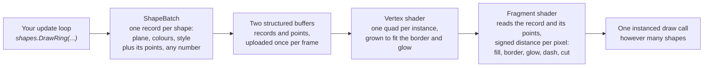
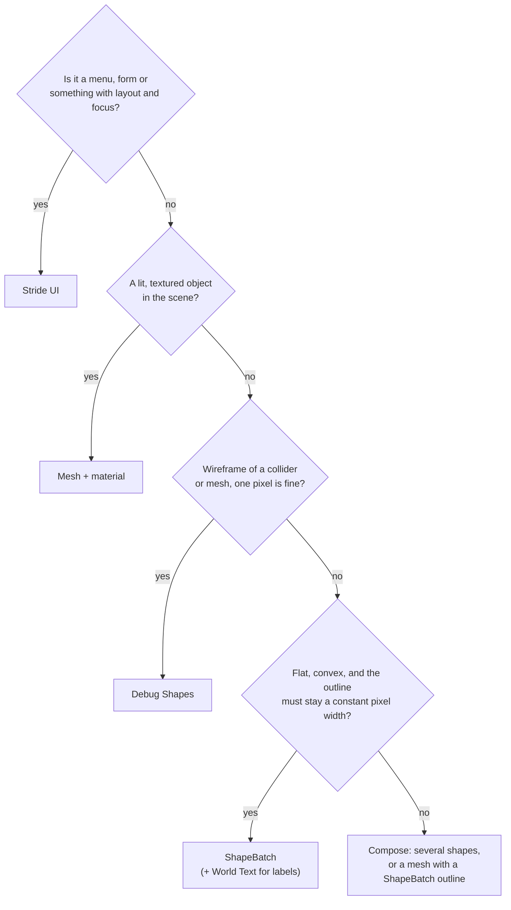

# ShapeBatch - vector shapes without meshes, materials or a UI tree

Almost every panel, ring, gauge, glow and dashed line in the toolkit's recent examples - the 2D
panels gallery, the spaceship HUD, the Box2D scenes, the in-scene console of the SignalR example -
is drawn by one thing: `ShapeBatch`, in the `Stride.CommunityToolkit.Shapes` package. This page is
about *why* it exists and what makes it different, because the answer is not obvious from the API,
and the technique it uses is the reason it can do what the engine's own tools cannot.

If you only want the method list, the [ShapeBatch example](../code-only/examples/shape-batch.md)
tours every shape and the API reference has the signatures. Read on for the thinking.

## The problem: an outline that stays the same width

Draw a circle on the ground of a 3D scene as a marker under a unit. Now walk the camera away
from it. With any mesh-based drawing, the outline of that circle shrinks with distance exactly as
the circle does, because the outline *is* geometry: a ring of triangles some fraction of a metre
wide. Ten metres away it is a hairline; a hundred metres away it is gone. Zoom a 2D scene out and
every border on every shape thins to nothing at the same moment.

A designer never wants that. A selection ring, a HUD frame, a gauge, a debug outline - all of them
want a border that is *two pixels wide*, whatever the zoom, distance or window size. That is a
screen-space property, and no amount of world-space geometry can deliver it. You would have to
rebuild the ring every frame, per shape, from the camera's current scale. Which is a shader.

## The tempting paths, and why each one stops short

Before ShapeBatch, three things in Stride looked like the answer. Each is the right tool for
something else.

**Stride UI.** The UI system is a retained-mode tree: `Canvas`, `StackPanel`, `Border`,
`TextBlock`, `ImageElement`, laid out by rules, with input routing and focus. It draws *textured
quads* - a rounded, anti-aliased panel is a sprite asset with nine-slice borders, and scaling it
stretches pixels. There are no vector primitives: no circle, no arc, no ring, no dashed line, no
polygon. A `UIComponent` can stand in the world as a plane, but it is one rectangle with a
resolution, not shapes lying on the deck, facing the camera, or swung into a thick 3D line. Stride
UI is the right tool for a menu, a form, a drag-and-drop inventory
([E04_StrideUI_DragAndDrop](../code-only/examples/stride-ui-draggable-window.md)). It is the wrong
tool for a glowing ring on the floor.

**Debug Shapes.** The toolkit's [Debug Shapes](debug-shapes.md) draws real geometry: primitive
meshes for cubes, spheres and capsules, hardware lines for lines. Perfect for "where is this
collider" - and the line width is whatever the driver gives you, which on every modern API is one
pixel, because the shader's `LineWidthMultiplier` is a solid-or-wireframe toggle (1 or 10000), not
a width. Circles are polylines, so they are never anti-aliased and never constant-width.

**Meshes and materials.** Build the ring as a mesh, give it a material, add a `ModelComponent`.
This works, and the Box2D Junkyard replica originally did exactly this. What it cost, in order:
a border that had to be rebuilt per zoom bucket to look pixel-constant; a fill and a border mesh
whose draw order flipped at random between runs (opaque-stage sorting is draw-order dependent per
material pair); a rewrite of the border as a non-overlapping ring so order could not matter; and
then the discovery that a transparent material on an *instanced* mesh renders at full opacity in
Stride 4.4. Days of work for a rectangle with a border. The record is in the example's history and in
`notes/upstream/`; the lesson is that this path fights the engine at every step because the
engine's mesh pipeline was built for lit, opaque, textured objects, and a debug rectangle is none
of those.

## The idea: measure the shape per pixel

Box2D's own testbed had already solved this, in about sixty lines of GLSL. Erin Catto's
`solid_polygon` shader draws every body in the physics debug view as a **signed distance function**:
the GPU draws one screen-aligned quad per shape, and for every pixel of that quad the fragment
shader computes how far the pixel is from the shape's edge - negative inside, positive outside.
Everything follows from that one number:

- inside by more than the border width: fill colour;
- inside by less than the border width: border colour;
- outside: transparent, with anti-aliasing from a smooth step over the last pixel.

The border width is compared in *pixels*, because the shader knows the current pixel scale.
So the border is two pixels wide at every distance, for free, with no geometry to rebuild. Rounding
a corner is subtracting a radius from the distance. A circle is a polygon with one vertex and a
radius; a capsule is two vertices and a radius; a rounded rectangle is four vertices and a radius.

`ShapeBatch` is that shader, ported to SDSL and extended. The extensions are all more functions of
the same distance: a hollow band gives rings and annuli, an angular cut gives sectors and arcs, a
glow is the distance falling off outside the edge, dashes fold a gap pattern into the distance
along the outline, a gradient runs across the shape's own extent, and an opacity multiplies the
final alpha. A **polyline** is the distance to the nearest of a run's segments, which makes a
stroke around it a curve with round joins and caps and no geometry for either. And - the part the
testbed never needed - each shape carries its own plane in 3D.

The shader is three files composed as SDSL mixins - `ShapeDistance` (the distance functions),
`ShapeColor` (unpacking and compositing) and `ShapeShader` (the streams and the two stages) - which
is the engine's own idiom for sharing shader code, and what lets the distance functions be reused
without copying them.



The whole frame's shapes - thousands of them, if you like - go out as a single instanced draw of
one shared quad. No models, no materials, no assets; the package ships one shader.

## Why it is a *batch*

The API deliberately echoes `SpriteBatch`, and the mental model is the same: **immediate mode**.
You submit shapes every frame from your update logic, the batch draws them once, in submission
order, and forgets them. Nothing is retained, so there is nothing to keep in sync - a HUD is one
draw routine that reads the game's state, not a tree of objects whose properties have to be
updated when the state changes. Compare the two ways to show a fuel gauge:

```csharp
// Retained: create once, then remember to update it every time fuel changes
var bar = new Border { Width = 120, Height = 8, BackgroundColor = Color.Green };
canvas.Children.Add(bar);
// ... somewhere else, on every change ...
bar.Width = 120 * fuel;

// Immediate: the gauge is a function of the state, drawn every frame
shapes.Fill.Set(Color.Green, 0.95f);
shapes.DrawRectangle(center, axisX, axisY, new Vector2(120 * fuel, 8), Color.Green);
```

The second has no state to leak, no ordering bugs, and it restyles itself when the scheme changes
because it reads the scheme every frame. Every board in the SignalR example is written this way:
`StationBoard.Draw` runs from scratch each frame from the deck's census and the console's colours.

Style properties - `BorderWidth`, `Fill`, `Glow`, `Dash`, `Gradient`, `Opacity` - are *current
state*, captured by each draw call as it is made, exactly as a sprite batch captures its blend
state. Set them, draw, change them, draw again. Two batches can coexist with different depth
behaviour: one depth-tested for decals and markers the scene can cover, one overlay batch for gizmos
that must always show ([the playground](../code-only/examples/shape-batch.md) runs both; press T).

## Flat shapes, anywhere in 3D

The testbed was 2D. Making the same shader work in a 3D scene took one idea: every shape stays
flat but carries its own plane, in one of three modes.

| `PlaneMode` | The plane is | Gives you |
|---|---|---|
| `Fixed` | The two axes you pass | Discs on the floor, decals, panels standing on a wall or hanging in space |
| `Screen` | Aligned to the screen, facing the camera | Billboards that keep their shape from any angle |
| `Axial` | Your X axis kept, the plane swung about it to face the camera | A capsule between two points becomes a **thick 3D line** with round ends - the thing hardware lines cannot do |

Perspective came almost free. The vertex shader passes the clip-space `w` as a varying, which
interpolates to exactly the fragment's `w`, so a pixel-measured border is scaled correctly under a
perspective camera; under an orthographic 2D camera `w` is 1 and the 2D path is bit-identical to
the testbed's, which is how the Box2D examples were verified against it.

## Where it came from, and where it went

The renderer was born as the Box2D package's debug draw on 2026-08-31, because the mesh approach
above had failed to reproduce the testbed's look. The same day it became clear it had nothing to
do with Box2D - a gauge, a panel and a selection ring are the same shape as a physics body - so it
was promoted, 3D-enabled and named `ShapeBatch`. It went into the core toolkit first and moved out
again *the same day*: the core package had been free of shaders and assets, and one shader in it
would have cost that property for every consumer. It now lives in its own package, mirroring how
`DebugShapes` ships its shader, and pairs with two things in core:

- **[World Text](world-text.md)** for text on a shape. A `WorldTextComponent` with `Billboard = false`
  lies in its entity's XY plane, so it sits on a panel with the panel's rotation; its `GlowSize`
  matches the shapes' glow. Text is the one thing an SDF shader should not attempt.
- **`DisplayScale`** so that "two pixels" means two pixels on a 100% display and three on a 150%
  one, the same rule the overlay and the text renderers follow. `AutoScale = false` opts out.

`ShapeComponent` is the small bridge into the entity system: a shape drawn from an entity's
transform, so a thing can be a shape without a model, and it appears in Game Studio's property grid.

## Two scars worth knowing about

**The blend state.** For a week every glow looked harsh and a fill's alpha seemed to be ignored.
The shader produced straight alpha - the testbed's convention - and the render feature was blending
it as if premultiplied. One line (`BlendStates.NonPremultiplied`) softened every glow and made
opacity mean opacity, across every example at once. The shader has since moved to premultiplied
compositing, the convention every Stride batch uses: layers add without a division, the alpha left
in a render target is right, and an additive glow (`Glow.Additive`) is just a glow with no alpha.
The lesson stands either way: if a fade "does nothing", check the blend before the shader.

**Colour space.** The palette is sRGB bytes and Stride's backbuffer is sRGB, so the shader decodes
each colour to linear light - with the real sRGB curve, not `pow 2.2`, which crushed every dark
value - and only when the device says the target is linear. A gamma pipeline gets the bytes as they
are. Compositing happens in that linear light, the same space the hardware blends the shape into
the scene, so a border over a fill and a shape over the world are the same kind of mix.

**Colours are integers.** A colour packed as four bytes into a `float` can form a NaN bit pattern
(alpha 255 with blue over 127 does it), and GPUs canonicalise NaNs on read, destroying the red
channel. Every colour in the instance record is a `uint`. The symptom looks exactly like a
struct-layout mismatch; the fix was semantics, not layout.

## What it is not

Honest limits, so you reach for the right tool:

- **Convex fills only.** Any number of vertices, but the fill of a concave polygon is not what
  you would expect. Strokes are the exception: `DrawPolyline` and `DrawPixelPolyline` take a run
  of any length and any shape - a curve, a path, a concave HUD frame, closed or open - as one
  stroke with round joins. What a stroke cannot do is fill the inside of a concave run.
- **Very long translucent strokes bead slightly.** A run of more than 64 points is drawn as a few
  pieces that share a point, because every fragment of a stroke tests every segment of its run;
  where two pieces meet the round cap is drawn twice, and under `Opacity` below one that is a
  faintly brighter dot. The playground's line demo draws a 48-point run at half opacity, which is
  one piece, so nothing shows there.
- **Flat.** A sphere outline is a billboard disc; a wireframe of an arbitrary mesh needs a
  different shader (barycentric, `fwidth()`-based) that does not exist yet.
- **No text, no images.** Pair with World Text; a texture on a shape is a separate project.
- **No layout, no input.** It draws. If you want a clickable button in the world, you pick it
  yourself - the SignalR example's `Board` class does it with one ray-plane intersection in board
  coordinates, and that is about fifteen lines.
- **One sort decision per batch.** A batch is a single render object with a meaningless bounding
  box, so how it sorts against *transparent meshes* is one decision for all its shapes. Use an
  overlay batch (`depthTest: false`) for things that must never be covered rather than trusting
  the sort.

## Which tool, then?



## One example, mapped

The SignalR example's in-scene console (`E13_SignalR/Station/`) uses every idea on this page:

| Piece | What it is | Idea from this page |
|---|---|---|
| `Board` | A plane in the world with `(u, v)` coordinates and a pick | Flat shapes on a `Fixed` plane; input is yours to add |
| `StationBoard.Draw` | Panel, rail, dividers, buttons, bars - rebuilt every frame | Immediate mode; style state captured per call |
| Scheme buttons | `Fill` solid for the chosen one, `Glow` for the hovered one | Fill and glow are functions of the same distance |
| `DrawCornerTicks` | A quarter `DrawArc` plus two `DrawPixelLine`s per corner | Angular cut; pixel-measured stroke |
| `Labels` | World text entities placed with the board's rotation | Text pairs with shapes, it is not one of them |
| `DeckEffects` rings | `DrawRing` with `Opacity` fading and radius growing | Opacity multiplies the final alpha |
| Starfield | 400 `DrawBillboardCircle`s at 380 m in the same batch | `Screen` plane; thousands of shapes, one draw |

Everything above is a few hundred lines of ordinary C# calling a handful of draw methods, which is
the actual answer to "why wasn't it always done this way": it could have been. The technique is
older than the toolkit and lives in every physics testbed and most 2D engines. Stride's rendering
grew up around meshes, materials and a textured UI, so nobody had put an SDF shape shader behind a
sprite-batch-shaped API in it. Once one existed, panels and gauges stopped being a project and
became a draw call.
